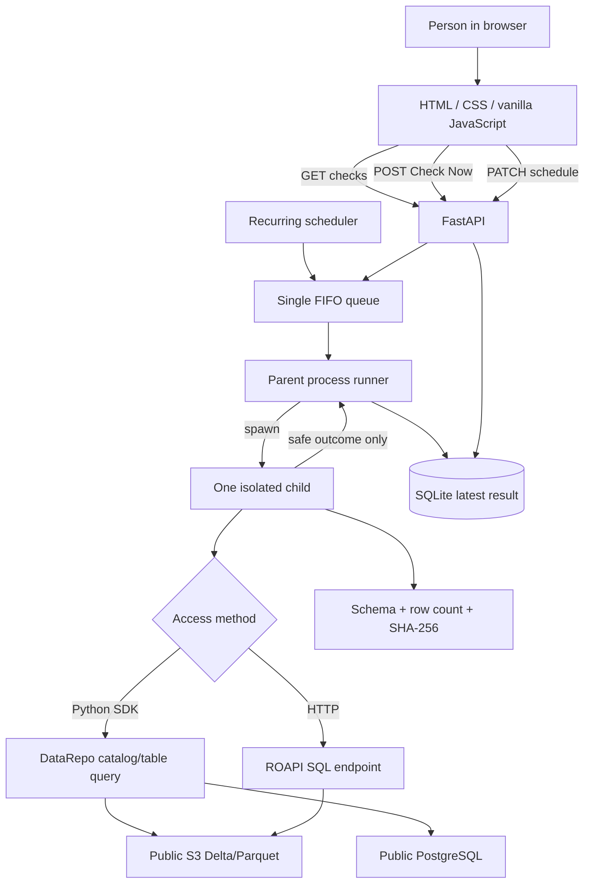

# DataRepo Doctor: From Zero to a Complete Mental Model

This guide assumes you have never used DataRepo, FastAPI, object storage, PostgreSQL, queues, child processes, or browser APIs. It builds the system one idea at a time and then follows a real check through every layer of code.

By the end, you should be able to explain what the application proves, where the data physically lives, how DataRepo retrieves it, why the queue and child process exist, what latency means, and why a green result is trustworthy.

## 1. The problem in plain English

A scientist does not care whether a storage server responds to a ping. They care whether their supported data-access code can retrieve the result they need.

DataRepo Doctor repeatedly asks one narrow operational question:

> If `doctor_reader` uses this supported DataRepo access path from this environment right now, can it retrieve the entire bounded expected result, and how long does that successful query take?

Each important word constrains the answer:

- **`doctor_reader`** means one representative read-only identity, not every possible user.
- **Supported DataRepo access path** means the same catalog/table interface or generated ROAPI endpoint a consumer uses. It does not mean a direct S3 or database ping.
- **Right now** means the result is synthetic monitoring, not a historical guarantee.
- **Entire bounded expected result** means a deliberately small query with exact filters, selected columns, row count, schema, and fingerprint.
- **Successful query time** means latency is reported only after complete materialization or decoding. It is not a health threshold.

A healthy result does not prove that all data is fresh, all queries work, all users have permission, or the science is correct. It proves one exact retrieval contract.

## 2. The minimum vocabulary

### Application and process

An application is the whole DataRepo Doctor system. A process is one running operating-system program. The normal deployment has one FastAPI application process. Each check temporarily creates a separate child process.

### Frontend and backend

The frontend is the HTML page in the browser. It presents state and sends actions. The backend is Python. It owns probes, the queue, scheduler, subprocesses, validation, and persistence.

The frontend never queries S3, PostgreSQL, DataRepo, or ROAPI directly. It asks the backend to run a named check.

### API and HTTP

An API is a defined way for programs to communicate. The browser calls FastAPI over HTTP:

- `GET` reads state.
- `POST` requests a new action.
- `PATCH` changes part of an existing configuration.

ROAPI is a separate read-only HTTP API that exposes a catalog-backed table. One monitor check calls it to prove that retrieval surface works.

### Catalog, database, table, row, column, and schema

A catalog organizes named databases. A database contains named tables. A table returns rows. Each row has named columns. A schema says which columns and types should exist.

DataRepo gives Python code one consistent catalog/database/table model even when the physical source is Delta Lake, Parquet, or a Python function backed by PostgreSQL.

### SDK

SDK means software development kit. Here it refers to the public DataRepo Python package. A normal query resolves a catalog database and table, applies filters/arguments and selected columns, then materializes the result.

### S3, Parquet, and Delta Lake

S3 is object storage: named buckets contain objects addressed by paths. Parquet is a columnar data-file format. Delta Lake adds a transaction log around data files so readers can resolve a consistent table version.

The normal checks read public objects stored in Amazon S3. The integration tests use MinIO, an S3-compatible service, to test credentials and controlled failures.

### PostgreSQL

PostgreSQL is a relational database server queried with SQL. The RNAcentral check uses a DataRepo custom Python function table. DataRepo invokes that function, and the function issues a bounded read-only PostgreSQL query.

### Lazy and materialized data

DataRepo returns a lazy frame for many tables. A lazy query is only a plan. Calling `.collect()` executes it and returns the complete materialized result. DataRepo Doctor does not stop after constructing the plan because that would not prove the data can be retrieved.

### Queue and FIFO

A queue is an ordered waiting line. FIFO means first in, first out. Manual and scheduled jobs enter the same queue. Exactly one job runs at a time.

### Process isolation

Isolation means each third-party retrieval runs in a new child process. The parent can kill a hanging child without killing FastAPI or permanently blocking the queue.

### Canonicalization and fingerprint

Canonicalization converts a result into one deterministic byte representation. SHA-256 hashes those bytes into a fixed-size fingerprint. If a value, type, row, or column changes, the fingerprint changes.

## 3. System overview



There are three important trust boundaries:

1. The browser receives operational metadata plus rows only for probes explicitly approved for result display; it never receives credentials.
2. The child receives one serialized `ProbeSpec` and environment-based credentials.
3. The parent receives one serialized `ProbeOutcome`, never a DataFrame, raw HTTP body, or traceback. That outcome may contain an approved copy of a public bounded result.

## 4. Repository map

The simplified Python package has a short reading order:

| File | Responsibility |
|---|---|
| `models.py` | Typed probe and outcome contracts |
| `checks.py` | The four real check definitions |
| `orchestration.py` | FIFO queue and recurring scheduler |
| `runner.py` | Child process, timeout, stages, errors, and timing |
| `retrieval.py` | DataRepo Python and ROAPI retrieval code |
| `validation.py` | Canonical result validation and hashing |
| `storage.py` | Two SQLite tables and repository operations |
| `app.py` | FastAPI lifecycle, API routes, and static files |
| `static/` | One HTML page, stylesheet, and browser script |
| `seed.py` | Generates/validates ROAPI config and controlled test fixtures |

Outside the package:

- `demo_catalog/` defines the actual DataRepo catalog.
- `tests/` contains unit, real integration, and fault tests.
- `docker-compose.yml` wires services together.
- `Dockerfile` builds one Python image; Node is not involved.

## 5. DataRepo versus DataRepo Doctor

DataRepo was made to let consumers retrieve data through a consistent catalog abstraction instead of learning every physical source's API.

DataRepo's job is to:

- represent native Parquet and Delta tables;
- expose Python function tables;
- apply filters and selected columns;
- return lazy frames that can be materialized; and
- provide catalog metadata that can generate ROAPI configuration.

DataRepo Doctor's job is to:

- decide which representative queries matter;
- schedule and queue them;
- isolate each execution;
- measure the supported retrieval path;
- validate the full bounded result;
- classify safe failures;
- retain one latest outcome; and
- present it in a dashboard.

The monitor does not reimplement DataRepo. It calls the public package.

## 6. The literal data sources

### Check 1: native Delta in public Amazon S3

- Physical source: `s3://aws-bigdata-blog/artifacts/delta-lake-crawler/sample_delta_table`
- Owner: Amazon Web Services
- Data format: Delta Lake
- Access: DataRepo Python SDK
- Bounded result: five declared product IDs and four selected columns

The catalog declares a native Delta table. DataRepo resolves the Delta transaction log and underlying objects, applies the bounded filter, and returns a lazy frame. The child calls `.collect()`.

### Check 2: native Parquet in public Amazon S3

- Physical source: `s3://pudl.catalyst.coop/v2024.11.0/core_eia__codes_energy_sources.parquet`
- Owner: Catalyst Cooperative
- Data format: Parquet
- Access: DataRepo Python SDK
- Bounded result: five fixed energy codes and five selected columns

DataRepo's native Parquet support reads the real public object. There is no local fallback file in the normal catalog.

### Check 3: RNAcentral public PostgreSQL

- Physical source: `hh-pgsql-public.ebi.ac.uk:5432/pfmegrnargs`
- Owner: RNAcentral / EMBL-EBI
- Access: DataRepo Python SDK to a custom `@table` function
- Bounded result: two fixed archived RNA accessions and three selected columns

The catalog function takes two bounded arguments. Inside the function, `psycopg` connects with the read-only public reader and issues the SQL query. The monitor still reaches it through `database.table(...)`, so it proves the DataRepo function-table path rather than bypassing DataRepo.

### Check 4: ROAPI over HTTP

- Physical source: the same versioned PUDL Parquet object
- Access: HTTP POST to ROAPI's SQL endpoint
- Bounded result: the same five codes and five columns as check 2

The seeding/configuration command derives the table configuration from the DataRepo catalog metadata. The monitor builds bounded SQL from the typed probe and decodes the complete JSON response.

### Controlled test-only services

MinIO and local PostgreSQL run only under Compose's `test` profile. They let tests change paths, credentials, values, and service availability without damaging a public service. A healthy default dashboard entry is never a mock.

## 7. The demo catalog

Open `demo_catalog/catalog.py`. It creates a DataRepo `Catalog` containing a `public_science` database. That database exposes:

- a native `DeltaTable` for AWS products;
- a native `ParquetTable` for PUDL energy codes; and
- the `rna_xrefs` Python function table.

The important idea is that source-specific configuration is catalog-side. Retrieval-side code uses the common DataRepo interface.

A Python check eventually performs the equivalent of:

```python
module_name, attribute = spec.catalog.split(":", 1)
catalog = getattr(importlib.import_module(module_name), attribute)
database = catalog.db(spec.database)
lazy_frame = database.table(
    spec.table,
    filters=datarepo_filters,
    columns=list(spec.selected_columns),
)
frame = lazy_frame.collect()
```

Function tables receive `spec.arguments` instead of `filters`. This is very similar to how a DataRepo consumer retrieves a known table: resolve catalog, choose database/table, provide query inputs, select columns, and collect.

The monitor adds operational machinery around that ordinary query. It does not change the query abstraction.

## 8. Probe specifications

Every dashboard row begins as one `ProbeSpec` in `checks.py`.

### Identity fields

- `check_id` is stable across restarts and persistence.
- `display_name` and `description` explain the row.
- `catalog`, `database`, and `table` identify the DataRepo object.
- `access_method` chooses `python_sdk` or `roapi_http`.
- source owner, URI, version, license, and documentation explain physical provenance.

### Query fields

- `filters` contain explicit DataRepo filter clauses.
- `arguments` contain bounded function-table arguments.
- `selected_columns` prevent an accidental unbounded column read.
- `query_description` is safe display text with literal query values redacted.

The API never serializes raw filter or argument structures. It provides a readable credential-free code example instead. For the current public probes, that example includes the public bounded literals so a reader can see the actual call. Future sensitive probes must keep result display disabled.

### Validation fields

- `expected_schema` declares exact column order, types, and nullability.
- `expected_row_count` declares the exact number of materialized rows.
- `sort_columns` make row order deterministic.
- `expected_sha256` declares the expected canonical result fingerprint.

### Operational fields

- `timeout_seconds` is a hard safety boundary.
- `default_interval_minutes` defaults to 60.
- `phase_offset_minutes` staggers startup cadence.
- `environment` identifies the logical execution environment.
- `credential_profile` is always `doctor_reader`.
- `spec_version` and the computed `spec_hash` identify the contract version.

Pydantic validates the specification at import/startup. It rejects a probe with no filters or arguments, no columns, duplicate columns, invalid sort columns, schema-column mismatch, invalid fingerprint, invalid timeout, or obvious secrets.

## 9. Clicking Check Now: complete walkthrough

### Step 1: browser request

`static/app.js` sends:

```http
POST /api/checks/aws-delta-products-sdk/run
```

The browser sends only the stable check ID. It does not construct the DataRepo query.

### Step 2: FastAPI delegates to the queue

`app.py` calls `probe_queue.enqueue(check_id)`. An unknown ID returns HTTP 404.

### Step 3: deduplication

`ProbeQueue` checks its in-memory state. If the check is already queued or running, it returns that existing state. It does not add a duplicate.

### Step 4: FIFO execution

The one async queue worker takes the earliest ID, marks it `running`, and calls the synchronous process runner in a helper thread. The event loop remains responsive to dashboard polling.

### Step 5: fresh child process

`ProcessProbeExecutor` uses `multiprocessing.get_context("spawn")`. It creates a one-way pipe and starts `worker_main` in a fresh process.

The child receives a JSON `ProbeSpec`. Environment variables provide credentials. This matters because process arguments and SQLite never contain secret values.

### Step 6: access-method dispatch

`execute_probe` imports `retrieve` inside the child. `retrieve` selects Python SDK or ROAPI based on the typed enum.

Keeping DataRepo imports in the child also keeps heavy data libraries out of the long-lived FastAPI parent.

### Step 7: timing begins

`perf_counter_ns()` starts immediately before supported user-path setup.

- Python path: before catalog import.
- ROAPI path: before SQL/request setup.

This monotonic performance clock is appropriate for elapsed time because wall-clock changes cannot make it run backward.

### Step 8: real retrieval

The Python path imports the catalog, resolves the table, creates DataRepo filters, requests only selected columns, calls the real DataRepo table, and fully calls `.collect()`.

The ROAPI path builds bounded SQL, sends the HTTP request, requires success, reads the complete body, decodes JSON, and normalizes declared columns.

No probe opens S3 objects directly or connects to PostgreSQL outside the catalog function.

### Step 9: query latency stops

The primary latency stops only after the result has been fully materialized or the HTTP response fully decoded. It does not include validation, IPC, or SQLite persistence.

### Step 10: full validation

The child validates exact row count, schema/types, deterministic sort, and SHA-256. Validation has its own diagnostic phase timing.

### Step 11: approved display rows are copied and working rows are discarded

For a probe with `display_result_rows=True`, the child copies the already validated public bounded rows into the outcome. The working materialized list is then cleared. Probes default to `False`, so a new check does not expose values accidentally.

### Step 12: safe outcome crosses the pipe

A healthy outcome contains query latency, diagnostic phases, total duration, versions, environment, identity, and—only for an opted-in public probe—the bounded result rows used by the dashboard.

An unhealthy outcome contains no query latency. It contains stage, mode, safe summary, optional scrubbed detail, and total duration.

### Step 13: parent timeout behavior

The parent waits at most `timeout_seconds`. If the child is still alive, the parent kills and reaps it and records `timeout`. Partial elapsed time is total probe duration, not user query latency.

If the child exits without a serialized outcome, the parent records `worker_crash`.

### Step 14: persistence and continuation

The parent replaces the one latest SQLite row for the check. The queue marks the job idle and calls `task_done()`, even after a failure. The next queued check can run.

### Step 15: dashboard update

The browser polls `GET /api/checks` every two seconds. Running is shown as a neutral activity label beside the last completed health. It never becomes a third health classification.

## 10. Canonical validation

Query completion alone is insufficient. A query can succeed while returning zero rows, missing rows, wrong columns, or changed values.

Validation happens in this order:

1. Compare actual list length with `expected_row_count`.
2. Verify every row has exactly the declared columns in declared order.
3. Convert every value according to its declared type.
4. Sort rows by `sort_columns`.
5. serialize `drd-canonical-v1` JSON Lines.
6. Compute SHA-256 and compare with `expected_sha256`.

Canonical type rules include:

- null is an explicit tagged value and allowed only on nullable fields;
- integers become decimal strings tagged with their width;
- decimals are normalized without insignificant trailing zeros;
- finite floats use exact hexadecimal representation;
- booleans remain booleans;
- dates use ISO `YYYY-MM-DD`;
- timestamps become UTC with microseconds and `Z`;
- strings are UTF-8 JSON strings;
- column order follows the contract, not dictionary accident.

The expected fingerprint is computed when authoring/seeding the fixture contract, not during a normal run. Computing expected from observed data during the run would make every changed result pass.

## 11. Health and latency

Completed health is binary:

- **healthy**: complete retrieval and all validations passed;
- **unhealthy**: anything else.

Before the first completed run, the UI may say “Never checked.” That is initialization state, not a third health value.

Latency never determines health. A successful 200 ms and successful 20-second result are both healthy. The UI reports the number without inventing a threshold.

Timeout is a safety decision, not a claim that a query is “slow.” Once killed, the query did not successfully complete, so its query latency is `null`.

Diagnostic phases are honest rather than artificially identical:

- Python: catalog import, table resolution, query construction/eager access, remaining materialization.
- ROAPI: request setup, connect/server/transfer as observable from the client, response decode.
- Both: validation and total probe duration.

The application does not claim source execution time or time-to-first-row because those boundaries are not reliably exposed by every library.

## 12. Failures and privacy

The runner wraps risky blocks with an explicit stage. Typed exception chains determine the most truthful mode available.

| Stage | What was happening |
|---|---|
| `catalog_import` | Importing the configured Python catalog |
| `table_resolution` | Resolving database and table |
| `query` | Constructing/executing/materializing retrieval |
| `response_decode` | Decoding and normalizing complete ROAPI JSON |
| `validation` | Checking contract and fingerprint |
| `worker` | Parent/child lifecycle |

Stable modes include authentication, authorization, DNS, connection, source-not-found, HTTP, execution, decode, schema, count, fingerprint, timeout, crash, and unknown.

The UI shows four layers when safe:

1. stage;
2. stable machine-readable mode;
3. safe human summary; and
4. optional exception class plus scrubbed reason.

Raw exceptions are dangerous. A driver can include a DSN, URL query string, SQL literal, secret assignment, object path, or returned row. The sanitizer removes URLs, credential-like assignments, quoted values, long token-like strings, line breaks, and excess length. For unknown/database/object-store messages, it exposes only the exception class rather than guessing that arbitrary text is safe.

Full tracebacks are never persisted or sent to the browser.

## 13. Queue and scheduler

There is one `asyncio.Queue` and one worker task. Both manual and scheduled requests call the same `enqueue` method.

Global concurrency is one. This makes source load predictable and timing easy to interpret.

Every schedule row stores:

- interval in minutes;
- fixed phase offset;
- next run timestamp;
- enabled flag; and
- updated timestamp.

Default intervals are 60 minutes. Registry order creates offsets 0, 5, 10, and 15 minutes.

Changing an interval sets the next run to now plus the new interval. Enabling a disabled schedule makes it due. A manual run never calls schedule advancement, so it does not reset cadence.

After restart, persisted schedules are restored. If several are overdue, `enqueue_due` takes only the first registry item on each one-second tick. This avoids putting every check into the queue at the same instant.

## 14. SQLite persistence

SQLAlchemy maps two tables:

### `check_schedule`

One row per configured check. Overrides and next-run metadata survive restart.

### `latest_probe_run`

One row per check. Saving an outcome inserts or replaces its JSON. There is no history table.

Raw responses, credentials, raw filter/argument structures, and tracebacks are absent. The latest outcome for an explicitly displayable public probe contains its small validated result rows. Because outcomes are JSON, this field requires no table migration.

## 15. FastAPI and the browser

FastAPI's lifespan initializes storage, starts the FIFO worker, restores due work, starts the scheduler, and cleanly stops tasks on shutdown.

The API is deliberately small:

| Method/path | Response or action |
|---|---|
| `GET /api/checks` | Safe check details, readable query code, latest outcomes/displayable rows, schedules, and jobs |
| `POST /api/checks/{id}/run` | HTTP 202 plus queued/running state |
| `PATCH /api/checks/{id}/schedule` | Updated persisted schedule |
| `GET /api/healthz` | `{ "status": "alive" }` for app liveness |

`/api/healthz` says nothing about catalog health.

The browser uses three files:

- `index.html` provides semantic page structure and loading placeholders.
- `styles.css` provides responsive, keyboard-visible styling without animation.
- `app.js` polls and safely creates DOM elements.

Dynamic values use `textContent` or text nodes, not `innerHTML`. That prevents an error string or source description from becoming executable markup.

Every check has a concise row and an expandable diagnostic row. Its detail area shows the retrieval path, physical source, readable query code, timing or failure, and the data received by an opted-in successful public probe. The browser remembers expanded rows and restores focused controls after polling.

React was unnecessary here because the page has one data source, four rows, simple actions, and no complex client-side domain state. Removing it eliminates npm, a bundler, TypeScript duplication, a Node Docker stage, and a separate frontend test toolchain.

## 16. Docker and startup

The Dockerfile has one Python runtime stage and one test stage based on it. It:

1. copies Python metadata and source;
2. installs the package;
3. installs the API-compatible CPU-portable Polars 1.12 wheel;
4. runs as a non-root `doctor` user; and
5. starts exactly one Uvicorn worker.

Multiple Uvicorn workers are unsupported. Each would create its own in-memory queue and scheduler, breaking the global one-at-a-time guarantee.

Normal Compose services are:

1. `configure`: generate/validate ROAPI configuration from catalog-adjacent metadata;
2. `roapi`: expose the public PUDL table through HTTP;
3. `app`: serve FastAPI, the queue/scheduler, and dashboard.

The test profile additionally starts MinIO, PostgreSQL, read-only credentials, controlled fixture seeding, and the integration-test container.

## 17. Install and run from zero

### Docker path

1. Install Git and Docker Desktop/Engine with Compose.
2. Clone the repository.
3. Copy `.env.example` to `.env`.
4. Obtain the currently published RNAcentral public reader password from its linked documentation and set `DOCTOR_RNACENTRAL_PASSWORD`.
5. Run:

```bash
docker compose up --build
```

6. Open `http://localhost:8000`.
7. Click each Check Now button. Jobs will queue and run sequentially.
8. Expand a row to inspect its source, validation, timings, or safe failure.
9. Stop without deleting state:

```bash
docker compose down
```

### Local Python path

Use Python 3.12 or 3.13:

```bash
python -m venv .venv
```

Activate it, then:

```bash
pip install -e ".[dev]"
datarepo-doctor
```

ROAPI must still be reachable at `DOCTOR_ROAPI_URL`, and required source environment variables must be set.

## 18. Testing

### Unit tests

```bash
pytest tests/unit
```

These test probe safety, canonical values, schema/count/fingerprint failures, typed classification, error redaction, queue deduplication, sequential execution, crash recovery, schedule staggering, cadence, persistence, API redaction, static assets, and schedule controls.

### Real integrations and faults

```bash
docker compose --profile test run --rm --build test
```

The suite proves real DataRepo access to MinIO Delta, MinIO Parquet, and PostgreSQL function tables, plus real ROAPI HTTP. It also tests incorrect schema/count/fingerprint, stopped services, invalid paths/credentials, hanging functions, child crashes, and queue continuation.

### Static quality

```bash
ruff check .
mypy src
docker compose build app
```

There is no npm step. Browser behavior is verified against the production FastAPI-served page.

## 19. Demonstrating failures safely

Fault injection belongs in tests or temporary local environment changes, not the default registry.

- Stop ROAPI, run its check, and expect `connection_error` with no latency.
- Use a test probe with the wrong expected schema and expect `schema_mismatch`.
- Change expected count and expect `row_count_mismatch`.
- Change one controlled fixture value without changing count/schema and expect `result_fingerprint_mismatch`.
- Run the hanging test function and expect `timeout`, followed by a healthy queued check.
- Run the crashing test function and expect `worker_crash`, followed by a healthy queued check.

Restore the service or fixture and rerun. The one latest outcome should return to healthy.

## 20. Adding a new check

1. Identify one supported user retrieval path worth proving.
2. Choose a small deterministic slice. It must have explicit filters or function arguments.
3. Select only necessary columns.
4. Expose the source in `demo_catalog/` using the real public DataRepo interface.
5. Add the `ProbeSpec` in `checks.py` with the next five-minute phase offset.
6. Materialize the entire slice in an authoring/seeding context.
7. Declare exact schema and row count.
8. Compute the canonical fingerprint with `result_sha256` and review it before committing.
9. Write a query description without credentials.
10. Set `display_result_rows=True` only if every value is approved for browser display and SQLite persistence.
11. Add unit and real integration tests.
12. Verify the query-code and received-data sections in the expanded row.

Do not add a direct source ping, catalog-only import, `.limit(1)`, or metadata lookup and call it retrieval health.

## 21. Troubleshooting

### App is alive but checks are unhealthy

That is possible and correct. `/api/healthz` proves only FastAPI liveness. Expand the failed row and inspect stage, mode, and safe detail.

### RNAcentral fails

Confirm the public reader password is current, the environment variable is set, and outbound PostgreSQL traffic to port 5432 is permitted.

### Public S3 fails

Confirm outbound HTTPS works. The public tables use unsigned AWS access and explicit regions.

### ROAPI fails

Check `docker compose ps`, then ROAPI logs. The monitor should report connection or HTTP/decode failure truthfully.

### Check Now does nothing new

If the same check is queued or running, deduplication returns its existing state. This is expected.

### A check times out

The child should be killed and the next job should proceed. If the whole dashboard freezes, that is an application bug because the isolation guarantee was violated.

### Interval change moved next run

That is intentional: interval updates set the next run to now plus the new interval. Manual runs do not.

## 22. Security model

- All credentials come from environment variables.
- The logical identity is `doctor_reader`.
- Local MinIO and PostgreSQL fixture identities are read-only after seeding.
- Probe specs reject obvious secrets.
- API serialization omits filters and arguments.
- Raw ROAPI bodies stay in the child.
- Outcomes never contain credentials. Rows are included only by an explicit public-display opt-in.
- Unknown unstructured errors expose only exception type.
- Dynamic browser content is inserted as text.
- The container runs as a non-root user.

This internal MVP does not include user authentication. Do not expose it directly to an untrusted network without adding an approved access boundary outside the application.

## 23. Limitations and non-goals

The project intentionally does not implement freshness, null-rate, duplicates, distributions, scientific-quality checks, latency thresholds, degraded status, alerts, trends, history, percentiles, AI diagnosis, multiple identities, concurrent workers, distributed infrastructure, or remediation.

Live public services can change or disappear. A source-side release can legitimately cause a fingerprint mismatch until the bounded contract is reviewed and versioned. That is a useful unhealthy signal, not a reason to calculate a new expectation automatically.

## 24. How to explain the project

### Thirty-second version

> DataRepo Doctor is a synthetic retrieval monitor. It runs four small real queries through DataRepo's Python and ROAPI access paths using one read-only profile. Each query runs alone in a killable child process, fully materializes a bounded result, validates its schema, exact count, and fingerprint, and stores only the latest safe outcome. The dashboard shows binary health and successful latency. A failed query has a classified safe error and no latency.

### Why not a ping?

A ping proves a server responds. It does not prove the catalog imports, the table resolves, credentials work, filters and columns are accepted, the full result transfers, or the returned content is correct.

### Why keep the child process if the goal is simplicity?

Because third-party data code can hang or crash. Without a killable child, one bad query can permanently stop all later scheduled checks. The process code is essential reliability complexity.

### Why keep fingerprint validation?

Because successful execution can return incomplete or changed data. Count proves cardinality; schema proves shape; fingerprint proves deterministic content.

### Why is the frontend now plain HTML and JavaScript?

Because its responsibility is small: poll one endpoint, render four rows, and send three actions. A framework added build tooling and duplicated types without simplifying the domain.

You understand the project when you can trace this sentence through the code:

> A browser action enqueues a stable check ID; one worker spawns one child; the child performs a real supported DataRepo retrieval, stops successful latency after complete materialization, validates the result, optionally copies approved public rows for display, and returns one outcome that replaces the check's latest SQLite row.
