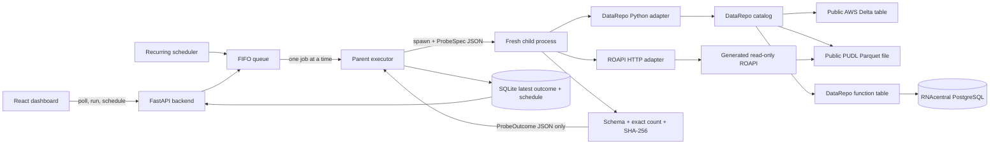

# DataRepo Doctor: The Complete Guide

This guide explains DataRepo Doctor from the ground up. It assumes you are new to the application,
DataRepo, Python web services, React, databases, object storage, containers, queues, and synthetic
monitoring. By the end, you should be able to:

- explain the problem the application solves and the limits of its guarantee;
- trace a click in the browser all the way to a real remote data source and back;
- identify which code belongs to DataRepo and which code belongs to DataRepo Doctor;
- explain every major technology and why it is present;
- understand the four retrieval paths, validation contract, timing, failure taxonomy, queue,
  scheduler, persistence, API, dashboard, Docker deployment, and test strategy;
- run and troubleshoot the project; and
- confidently describe the architecture to another engineer or scientist.

The shorter operational instructions are in [README.md](README.md). This file is the learning guide.

## Table of contents

1. [Start with the problem](#1-start-with-the-problem)
2. [Foundational concepts and vocabulary](#2-foundational-concepts-and-vocabulary)
3. [The complete system at a glance](#3-the-complete-system-at-a-glance)
4. [What is DataRepo, and what is DataRepo Doctor?](#4-what-is-datarepo-and-what-is-datarepo-doctor)
5. [The real data sources and four checks](#5-the-real-data-sources-and-four-checks)
6. [How the DataRepo catalog is built](#6-how-the-datarepo-catalog-is-built)
7. [How a check is specified](#7-how-a-check-is-specified)
8. [End-to-end walkthrough: clicking Check now](#8-end-to-end-walkthrough-clicking-check-now)
9. [The four retrieval paths in detail](#9-the-four-retrieval-paths-in-detail)
10. [Complete-result validation and fingerprinting](#10-complete-result-validation-and-fingerprinting)
11. [Health, latency, phases, and failures](#11-health-latency-phases-and-failures)
12. [Subprocess isolation and timeouts](#12-subprocess-isolation-and-timeouts)
13. [The FIFO queue and recurring scheduler](#13-the-fifo-queue-and-recurring-scheduler)
14. [SQLite persistence](#14-sqlite-persistence)
15. [The FastAPI backend](#15-the-fastapi-backend)
16. [The React dashboard](#16-the-react-dashboard)
17. [Docker, Compose, and startup order](#17-docker-compose-and-startup-order)
18. [Security and privacy](#18-security-and-privacy)
19. [Testing and quality checks](#19-testing-and-quality-checks)
20. [Run the application from zero](#20-run-the-application-from-zero)
21. [How to add a new check](#21-how-to-add-a-new-check)
22. [Troubleshooting](#22-troubleshooting)
23. [Design decisions, limitations, and non-goals](#23-design-decisions-limitations-and-non-goals)
24. [How to explain the project to someone else](#24-how-to-explain-the-project-to-someone-else)
25. [Reference appendices](#25-reference-appendices)

## 1. Start with the problem

Imagine a scientist has been told that a useful table exists in a data catalog. Seeing the table's
name in documentation does not prove the scientist can retrieve it. Many things can break between
discovery and actual use:

- the catalog can fail to import;
- the table can be renamed or removed;
- credentials can expire or lose permission;
- DNS can fail to resolve a service name;
- a database or HTTP service can be down;
- an object-storage URI can point to a missing object;
- a Delta transaction log or Parquet file can fail to decode;
- a filter can return too few or too many rows;
- values can change while the schema and row count remain the same; or
- a query can hang forever.

A storage ping, an HTTP liveness endpoint, or a `limit(1)` query can succeed while the scientist's
real retrieval path is broken. DataRepo Doctor therefore asks a stronger and very specific question:

> If a scientist uses this supported DataRepo access path right now, can the representative
> `doctor_reader` profile retrieve the entire bounded expected result, and how long does that
> successful retrieval take?

There are four important parts in that sentence:

1. **Supported DataRepo access path** means the monitor uses the same public Python catalog/query
   interface or generated ROAPI HTTP surface a user would use. It does not secretly bypass DataRepo
   and read the source directly.
2. **Right now** means this is an operational check of the current catalog, network, identity, source,
   decoder, and result—not a static code inspection.
3. **Entire bounded expected result** means the query is intentionally small and deterministic, but
   every row in that small slice must be materialized and validated.
4. **How long** means latency is reported on success. Latency is descriptive; it never changes health.

### The exact guarantee

When a check is healthy, the application has proved that one particular bounded query worked:

- from this local deployment;
- through the named Python SDK or ROAPI access method;
- using the logical `doctor_reader` profile;
- against the configured remote source;
- with the declared columns and filters or arguments; and
- with the expected schema, exact row count, and exact content fingerprint.

It does **not** prove that every possible query works, every user has the same permission, the source
is fresh, the data is scientifically correct, or the service will remain healthy after the check.

## 2. Foundational concepts and vocabulary

This section defines the terms used throughout the guide.

### Application, process, and service

An **application** is the whole product. A **process** is one running operating-system program. A
**service** is a process or group of processes reached through a stable interface, usually over a
network. DataRepo Doctor is one application composed locally from an app service and a ROAPI service,
plus external data services.

### API and HTTP

An **API** is a defined way for software to communicate. **HTTP** is the request/response protocol used
by browsers and web services. For example, the dashboard sends `POST /api/checks/{id}/run` to request
a check and polls `GET /api/checks` to read current state.

### Catalog, database, table, row, column, and schema

- A **catalog** organizes data that users are allowed to discover and query.
- A **database** is a named grouping inside the catalog.
- A **table** is data arranged into rows and columns.
- A **row** is one record.
- A **column** is one named field present across records.
- A **schema** declares the ordered column names, types, and nullability.

DataRepo's catalog lets a caller ask for a logical table without implementing the physical retrieval
details at every call site.

### SDK

An **SDK**, or software development kit, is a library developers call from code. The DataRepo Python
SDK exposes objects such as `Catalog`, `ModuleDatabase`, `DeltalakeTable`, `ParquetTable`, `Filter`,
and the `@table` decorator.

### Object storage and S3

**Object storage** stores blobs under bucket/key names rather than rows in a relational database.
Amazon S3 is a common object-storage protocol. An address such as
`s3://pudl.catalyst.coop/v2024.11.0/file.parquet` identifies a bucket and object key. MinIO is a local,
S3-compatible service used only by this project's integration tests.

### Parquet and Delta Lake

**Parquet** is a column-oriented file format designed for analytical data. It stores typed columns
efficiently and allows readers to select only needed columns.

**Delta Lake** stores Parquet data plus a transaction log. The log describes which data files make up
the current table version. Reading a Delta table therefore involves resolving the transaction log as
well as reading its data files.

### PostgreSQL and SQL

**PostgreSQL** is a relational database server. **SQL** is a language for selecting and transforming
relational data. The RNAcentral check executes a parameterized, read-only SQL query inside a DataRepo
function table.

### DataFrame and lazy execution

A **DataFrame** is an in-memory tabular object. A **lazy frame** describes a computation that has not
necessarily run yet. DataRepo returns an `NlkDataFrame`/Polars lazy result. Calling `.collect()` forces
the complete bounded result to execute and materialize. That call is essential: constructing a query
without collecting it would not prove the data can actually be retrieved.

### Queue and FIFO

A **queue** holds work waiting to run. **FIFO** means first in, first out. Manual and scheduled checks
enter the same queue. Only one check runs globally at a time, preventing local resource contention and
making behavior predictable.

### Process isolation

Each probe runs in a fresh child process. If a native library crashes or a query hangs, the parent app
can terminate that child without losing the scheduler, API, queue, or later jobs.

### Canonicalization and fingerprint

Different runtimes can represent the same value in different ways. **Canonicalization** converts every
validated result into one deterministic byte representation. A **SHA-256 fingerprint** is a 64-character
digest of those bytes. The monitor compares the actual digest with the expected digest to detect any
content change without saving or displaying the retrieved values.

### Container, image, and Docker Compose

- A Docker **image** is a packaged filesystem and startup definition.
- A **container** is a running instance of an image.
- **Docker Compose** defines several cooperating containers, their environment variables, networks,
  ports, volumes, health checks, and startup dependencies.

## 3. The complete system at a glance

The simplest mental model is:

```text
Browser dashboard
    → FastAPI
    → one FIFO queue
    → one fresh probe subprocess
    → DataRepo Python SDK or ROAPI HTTP
    → real remote source
    → complete bounded result
    → schema/count/fingerprint validation
    → safe outcome only
    → SQLite
    → dashboard polling
```

The fuller architecture is:



### The major boundaries

| Boundary | Responsibility |
|---|---|
| `domain/` | Pure typed contracts, health rules, errors, canonicalization, hashing |
| `registry/` | The four immutable production check definitions |
| `demo_catalog/` | DataRepo catalog and physical table/function definitions |
| `adapters/` | Execute either the Python DataRepo or ROAPI HTTP retrieval path |
| `execution/` | Stages, failure classification, subprocess lifecycle, FIFO worker |
| `scheduling/` | Decide when recurring checks become due |
| `persistence/` | Store schedules and one latest outcome per check in SQLite |
| `api/` | Safe HTTP endpoints and production frontend serving |
| `web/` | React dashboard and TypeScript browser models |
| `infra/` and Compose | Package and connect local services |
| `tests/` | Unit contracts, real integrations, and controlled faults |

## 4. What is DataRepo, and what is DataRepo Doctor?

This distinction is central.

### DataRepo's responsibility

DataRepo is the data-access abstraction. It provides:

- a `Catalog` containing named databases;
- `ModuleDatabase`, which exposes tables defined in a Python module;
- native `DeltalakeTable` and `ParquetTable` definitions;
- `Filter` objects and column projection;
- a `database.table(name, **arguments)` query interface;
- an `@table` decorator for custom Python-backed tables; and
- catalog export into ROAPI table configuration.

A scientist can ask the catalog for a logical table without reimplementing source-specific mechanics
in every notebook.

### DataRepo Doctor's responsibility

DataRepo Doctor is the operational monitor around those access paths. It provides:

- a fixed registry of bounded representative queries;
- schedules and Check now actions;
- global sequential execution;
- process isolation and hard timeouts;
- identical result validation for Python and HTTP retrieval;
- safe failure classification;
- latest-only persistence; and
- a dashboard for health, successful latency, schedules, and details.

DataRepo Doctor does not replace DataRepo. The critical Python call remains:

```python
database = catalog.db(spec.database)
lazy_frame = database.table(spec.table, **kwargs)
frame = lazy_frame.collect()
```

That code lives in
[`src/datarepo_doctor/adapters/python_datarepo.py`](src/datarepo_doctor/adapters/python_datarepo.py).

### Similarity to an ordinary scientist query

An ordinary user might write:

```python
database = catalog.db("science")
result = database.table(
    "recording_sessions",
    filters=(Filter("subject_id", "=", selected_subject),),
    columns=["session_id", "subject_id", "created_at"],
).collect()
```

The doctor performs the same catalog/database/table/filter/column/collect sequence. The difference is
purpose: a scientist uses the rows for analysis; the doctor validates a small expected slice and then
discards it.

## 5. The real data sources and four checks

The production-style registry contains four live checks:

| Check ID | Logical table | Access method | Literal physical source | Expected result |
|---|---|---|---|---|
| `aws-delta-products-sdk` | `public_science.products` | DataRepo Python SDK | `s3://aws-bigdata-blog/artifacts/delta-lake-crawler/sample_delta_table` | 5 rows, 4 columns |
| `pudl-energy-parquet-sdk` | `public_science.energy_sources` | DataRepo Python SDK | `s3://pudl.catalyst.coop/v2024.11.0/core_eia__codes_energy_sources.parquet` | 5 rows, 5 columns |
| `rnacentral-xrefs-function` | `public_science.rna_xrefs` | DataRepo Python SDK/function table | `hh-pgsql-public.ebi.ac.uk:5432/pfmegrnargs` | 2 rows, 3 columns |
| `pudl-energy-roapi-http` | exported `public_science_energy_sources` | ROAPI HTTP SQL | The same versioned PUDL Parquet object | 5 rows, 5 columns |

The PUDL URI is version-pinned so its expected contract is reproducible. The AWS tutorial Delta table
and RNAcentral database are externally maintained. A remote outage or unexpected result change is a
real unhealthy result because the product is explicitly checking the live access path.

### One logical identity

Every check reports the logical credential profile `doctor_reader` even though providers implement it
differently:

- public S3 reads are unsigned and require no individual AWS account;
- RNAcentral exposes a published read-only `reader` account, with its password supplied through the
  ignored `.env` file; and
- controlled test sources create local read-only credentials associated with `doctor_reader`.

The identity is a representative access profile, not a claim that every provider has a literal account
with the exact same username.

## 6. How the DataRepo catalog is built

The catalog begins in [`demo_catalog/catalog.py`](demo_catalog/catalog.py):

```python
from datarepo.core import Catalog, ModuleDatabase
from . import tables

DEMO_CATALOG = Catalog(
    {"public_science": ModuleDatabase(tables)},
    package_name="demo_catalog",
)
```

This creates one catalog database called `public_science`. `ModuleDatabase(tables)` inspects the
objects exposed by [`demo_catalog/tables.py`](demo_catalog/tables.py).

### Native Delta table

```python
products = DeltalakeTable(
    name="products",
    uri="s3://aws-bigdata-blog/artifacts/delta-lake-crawler/sample_delta_table",
    schema=...,
    unique_columns=["product_id"],
)
```

The object is a logical table definition. It tells DataRepo which source implementation and URI to
use. It does not contain the returned data.

### Native Parquet table

```python
energy_sources = ParquetTable(
    name="energy_sources",
    uri="s3://pudl.catalyst.coop/v2024.11.0/core_eia__codes_energy_sources.parquet",
    partitioning=[],
    partitioning_scheme=PartitioningScheme.HIVE,
)
```

This similarly maps the logical table to a real public Parquet object.

### Custom function table

```python
@table(...)
def rna_xrefs(accession_a: str, accession_b: str) -> NlkDataFrame:
    ...
```

DataRepo does not expose a native PostgreSQL table type in the pinned public package, so the catalog
uses its intended Python extension mechanism. The decorated function accepts explicit arguments,
executes a parameterized read-only SQL query, and returns a Polars lazy frame. Users still retrieve it
through `database.table("rna_xrefs", ...)`, not by calling the function directly.

## 7. How a check is specified

Production checks live beside the catalog in
[`src/datarepo_doctor/registry/probes.py`](src/datarepo_doctor/registry/probes.py). Each `ProbeSpec` is
immutable because Pydantic uses `ConfigDict(frozen=True)`.

### Identity and display fields

- `check_id`: stable machine ID used by the API, queue, schedules, and SQLite primary keys.
- `display_name` and `description`: human-readable UI text.
- `catalog`, `database`, and `table`: logical DataRepo identity.
- `physical_source`: concise source type for the main table.
- `source_owner`, `source_uri`, `source_version`, `source_license`, and
  `source_documentation_url`: safe provenance shown in details.
- `access_method`: `python_sdk` or `roapi_http`.
- `environment`: `public_internet` for production checks.
- `credential_profile`: always `doctor_reader`.

### Query fields

- `filters`: explicit DataRepo-style predicates for native tables.
- `arguments`: explicit arguments for function tables.
- `selected_columns`: the only columns allowed into the bounded result.
- `sort_columns`: deterministic keys used before fingerprinting.
- `query_description`: a human description whose sensitive literals are already redacted.
- `object_store_profile` and `object_store_region`: select unsigned public S3 or controlled local
  MinIO behavior without guessing based on a table name.

### Validation fields

- `expected_schema`: exact ordered names, types, and nullability.
- `expected_row_count`: exact number of required rows.
- `expected_sha256`: digest of the canonical complete result.

### Operational fields

- `timeout_seconds`: parent-process safety boundary.
- `default_interval_minutes`: 60 by default.
- `phase_offset_minutes`: 0, 5, 10, and 15 in registry order.
- `spec_version`: manually readable contract version.
- `spec_hash`: computed SHA-256 of the spec fields except the expected result SHA. It identifies the
  retrieval/configuration contract separately from the content digest.

### Startup safety validation

`ProbeSpec.validate_safety()` rejects a spec if:

- it has neither filters nor function arguments and is therefore unbounded;
- it selects no columns;
- selected columns are duplicated;
- schema names/order do not exactly equal selected columns;
- sort columns are absent or are not selected; or
- descriptions or arguments appear to contain passwords, tokens, secrets, access keys, credentials,
  or embedded credential URLs.

Because the registry is imported during app composition, invalid production specs prevent a normal
startup rather than becoming silently unsafe runtime checks.

## 8. End-to-end walkthrough: clicking Check now

We will trace the Delta check. The other checks reuse the same orchestration and validation.

### Step 1: the browser sends a request

The React `run` function in [`web/src/App.tsx`](web/src/App.tsx) sends:

```http
POST /api/checks/aws-delta-products-sdk/run
```

The browser does not execute DataRepo and never receives source credentials or result rows.

### Step 2: FastAPI enqueues the check

The `run_check` route in [`src/datarepo_doctor/api/app.py`](src/datarepo_doctor/api/app.py) calls:

```python
state = await probe_queue.enqueue(check_id)
```

It returns HTTP `202 Accepted`, which means the job was accepted, not necessarily completed.

### Step 3: the queue deduplicates and orders work

`ProbeQueue.enqueue()` checks the current in-memory state. If this check is already queued or running,
it returns that existing state instead of inserting a duplicate. Otherwise it records `queued`, adds
the check ID to an `asyncio.Queue`, and preserves FIFO order with other manual or scheduled jobs.

### Step 4: the one queue worker marks it running

The queue owns exactly one `_work()` coroutine. It takes the next ID, changes state from `queued` to
`running`, and calls the blocking executor via `asyncio.to_thread(...)`. Moving the blocking parent
executor to a thread keeps FastAPI's event loop responsive while the probe process runs.

### Step 5: the parent spawns a fresh process

`ProcessProbeExecutor` in [`src/datarepo_doctor/execution/engine.py`](src/datarepo_doctor/execution/engine.py)
uses Python multiprocessing with the `spawn` start method. It creates a one-way pipe and passes only
the serialized `ProbeSpec` into a new child.

The parent then waits at most `timeout_seconds`. If the child is still alive, the parent kills it,
reaps it, closes the pipe, and creates a safe `timeout` outcome. If the child exits without sending an
outcome, the parent creates `worker_crash`.

### Step 6: the child selects the Python adapter

`execute_probe()` in [`src/datarepo_doctor/execution/worker.py`](src/datarepo_doctor/execution/worker.py)
checks `spec.access_method`. The Delta check chooses `PythonDataRepoAdapter`.

Third-party DataRepo imports occur inside the isolated child. This helps contain native-library import
failures and ensures each probe begins from a fresh process state.

### Step 7: the adapter imports the configured catalog

The string `demo_catalog.catalog:DEMO_CATALOG` is split into a module and attribute. Python imports the
module and reads the catalog object. This is timed as `catalog_import` and wrapped in the explicit
`catalog_import` execution stage.

### Step 8: DataRepo resolves the database and table

The adapter executes:

```python
database = catalog.db("public_science")
```

It confirms `products` is present in `database.tables(...)`. A missing logical table becomes the safe
mode `table_not_found` rather than an unsanitized `KeyError` traceback.

### Step 9: monitor filters become DataRepo filters

The adapter transforms each domain `FilterClause` into a real `datarepo.core.Filter` and adds the
declared selected columns:

```python
kwargs["filters"] = tuple(Filter(column, operator, value) ...)
kwargs["columns"] = list(spec.selected_columns)
```

For public object storage it sets the unsigned S3 option and configured AWS region. No private AWS
credential is loaded.

### Step 10: the real DataRepo query executes

This is the central supported user path:

```python
lazy_frame = database.table("products", **kwargs)
frame = lazy_frame.collect()
```

`database.table(...)` resolves the catalog's `DeltalakeTable`, applies filters and projection, and
constructs/starts the underlying Delta retrieval. `.collect()` forces the entire five-row slice to be
materialized. The adapter then converts only the declared columns into ordered dictionaries inside the
child process.

### Step 11: query latency stops

`user_query_latency_ms` begins before catalog import and ends after complete materialization and row
conversion. Result validation is deliberately not included in this primary number.

### Step 12: the child validates the complete result

The shared pipeline verifies the exact row count, column order and types, deterministic sort, and
SHA-256 fingerprint. No returned value is logged, persisted, or sent to the browser.

### Step 13: rows are discarded

After validation succeeds, `result.rows.clear()` removes the materialized list before the boundary
outcome is built. The child sends only JSON describing health, timings, versions, environment, spec,
and safe failure fields.

### Step 14: the parent persists one latest outcome

The queue receives the `ProbeOutcome` and calls `DoctorRepository.save_outcome()`. The check ID is the
SQLite primary key, so a new completion inserts once and every later completion replaces that row's
JSON. There is no history table.

### Step 15: the queue continues

In `finally`, the queue marks the check `idle` and calls `task_done()`. This happens even when the
probe is unhealthy or crashes, so the next FIFO job is not stranded.

### Step 16: polling updates the dashboard

React polls `GET /api/checks` every two seconds. The next response contains the last completed outcome,
schedule, and current job state. The UI displays healthy plus latency on success, or unhealthy plus no
latency on failure. Running is a separate neutral job indicator; it does not overwrite the previous
completed health.

## 9. The four retrieval paths in detail

### 9.1 Python SDK to native Delta in public S3

The registry selects five fixed product IDs and four columns. The catalog maps `products` to a public
AWS Delta URI with a declared Arrow schema. DataRepo's `DeltalakeTable` handles the Delta transaction
log and object files. The monitor never calls Delta Lake or S3 directly in the normal probe.

```text
ProbeSpec filters/columns
  → DataRepo Filter objects
  → database.table("products", ...)
  → DeltalakeTable
  → unsigned public S3
  → collect all 5 rows
```

Why this path matters: a bucket can be reachable while its Delta log is missing, corrupt, unauthorized,
or inconsistent with its data files. A native query proves much more than a bucket ping.

### 9.2 Python SDK to native Parquet in public S3

The registry selects five fixed EIA energy codes and five columns. `energy_sources` is a DataRepo
`ParquetTable` pointed at a versioned PUDL object. DataRepo constructs the Parquet scan, applies the
filter/projection, and returns a lazy result that the doctor collects.

```text
ProbeSpec filters/columns
  → database.table("energy_sources", ...)
  → ParquetTable
  → public PUDL S3 object
  → collect all 5 rows
```

Why this is separate from Delta: both use object storage, but their readers and metadata paths differ.
Testing both proves two distinct native DataRepo table implementations.

### 9.3 Python SDK to a PostgreSQL-backed function table

The probe supplies two fixed accession arguments. `database.table("rna_xrefs", accession_a=...,
accession_b=..., columns=...)` resolves the decorated function. Inside that function:

1. `psycopg` opens the RNAcentral connection using an environment-only DSN.
2. `SET TRANSACTION READ ONLY` adds a runtime safety boundary.
3. Parameterized SQL uses `WHERE ac = ANY(%s)`; values are parameters, not string-concatenated SQL.
4. The complete two-row result is fetched.
5. Values are converted to declared Python types and returned as a Polars lazy frame.

The custom function contains source-specific SQL, but the user-facing retrieval remains DataRepo's
catalog API. This is analogous to putting a provider-specific implementation behind a stable interface.

### 9.4 ROAPI HTTP to public Parquet

ROAPI is a read-only HTTP/SQL service. During startup, the `configure` container calls DataRepo's
`export_to_roapi_tables(DEMO_CATALOG)`, keeps exactly the exportable PUDL table, and writes ROAPI YAML.
The runtime request then follows:

```text
ProbeSpec
  → bounded SQL generated by RoapiHttpAdapter
  → POST http://roapi:8080/api/sql
  → ROAPI table exported from the DataRepo catalog
  → public PUDL Parquet object
  → complete JSON response
```

This path does not call `database.table(...)` in the probe process on every request. Instead, DataRepo
defines/exports the HTTP table surface and ROAPI executes the request. That distinction is honest and
important: the Python checks are direct SDK use; the HTTP check is a DataRepo-generated retrieval
surface.

The adapter quotes identifiers, supports the allowed bounded operators, escapes string literals, adds
an `ORDER BY`, requires a successful status, and decodes the full JSON body. ROAPI omits JSON object
properties whose value is null. `_normalize_json_rows()` restores an omitted property only when the
contract declares that column nullable. A missing required property remains a decode failure.

## 10. Complete-result validation and fingerprinting

Both adapters return the same internal shape: an ordered list of dictionaries containing only selected
columns. The same pure validation pipeline handles both, preventing the HTTP path from receiving weaker
checks than the Python path.

### Validation order

1. Verify the exact materialized row count.
2. Verify every row's keys exactly match selected column names and order.
3. Sort rows by the declared deterministic keys.
4. Convert each value using its declared contract type and nullability.
5. Serialize a versioned canonical byte stream.
6. Compute SHA-256 and compare it with `expected_sha256`.

### Why all three contract dimensions are needed

- **Schema only** would miss deleted, duplicated, or changed rows.
- **Schema + count** would miss a changed value when the number of rows stayed constant.
- **Fingerprint only without explicit schema/count** would produce a less understandable failure and
  make type expectations implicit.

Together they answer whether the entire bounded expected result was retrieved correctly.

### Canonical format: `drd-canonical-v1`

The first UTF-8 JSON Lines record is a header containing the format version, ordered columns, and
contract types. Every later line is an ordered array of tagged values. The implementation is in
[`src/datarepo_doctor/domain/canonical.py`](src/datarepo_doctor/domain/canonical.py).

Type rules include:

| Type | Canonical treatment |
|---|---|
| null | Allowed only when `nullable=True`; tagged explicitly as null |
| string | Preserved as Unicode text |
| int32/int64 | Must be a non-boolean Python integer; serialized as decimal text |
| bool | Must be a Boolean, not integer 0/1 |
| decimal | Converted to `Decimal`, finite, normalized (`10.5000` becomes `10.5`) |
| float64 | Must be finite; uses exact hexadecimal float representation |
| date | ISO `YYYY-MM-DD`; datetime is not accepted as a date |
| timestamp | Normalized to UTC with microseconds and a `Z` suffix |

Canonical sorting removes dependence on source return order. Column order remains meaningful and is
part of the schema. NaN and infinities are rejected because they do not provide a simple stable
scientific contract here.

### Privacy benefit

The expected digest proves equality to a reviewed fixture result without putting result values in
SQLite, API responses, logs, or screenshots. A SHA-256 digest is not a substitute for access control,
but for these bounded fixtures it provides a compact correctness contract.

## 11. Health, latency, phases, and failures

### Binary completed health

A completed run is either `healthy` or `unhealthy`:

- healthy means the query completed and every validation passed;
- unhealthy means any retrieval, decode, validation, timeout, or worker condition failed.

`never checked` is only an initialization display when no outcome exists. `queued` and `running` are
job states, not health categories. The UI retains the previous completed health while a new job runs.

### Latency never changes health

There is no slow threshold, degraded state, SLO, or alert. A successful 500 ms and 5,000 ms query are
both healthy if their complete results validate. The dashboard reports the number and lets a human
interpret it.

### Primary latency boundary

For Python SDK checks, `user_query_latency_ms` starts before catalog import and ends after full collect
and conversion. It includes catalog import, table resolution, query construction/source access, and
remaining materialization.

For ROAPI, it starts before SQL/request setup and ends after complete response decoding. It includes
request setup, connection/server/transfer, and decode.

Validation and parent persistence are excluded from primary latency. They appear in phase or total
probe timing. Only healthy outcomes may contain primary latency; Pydantic enforces this invariant.

### Timeout is not “too slow”

The timeout is a safety boundary. When the parent kills a child, the outcome is unhealthy with mode
`timeout`, query latency is null, and any partial elapsed time is not presented as successful latency.

### Stages and modes

A **stage** says where execution was when failure occurred. A **mode** says what kind of failure it was.

| Stage | Examples |
|---|---|
| `catalog_import` | catalog module cannot import |
| `table_resolution` | logical table is missing |
| `query` | network, authentication, source, SQL, or query execution failure |
| `response_decode` | HTTP response cannot become the expected rows |
| `validation` | schema, row count, or fingerprint mismatch |
| `worker` | timeout, child crash, unexpected isolation failure |

Stable modes include `authentication_error`, `authorization_error`, `dns_error`, `connection_error`,
`source_not_found`, `http_error`, `query_execution_error`, `response_decode_error`,
`schema_mismatch`, `row_count_mismatch`, `result_fingerprint_mismatch`, `timeout`, `worker_crash`, and
`unknown`.

`execution_stage()` wraps exceptions with the current stage and truthful fallback. `classify_exception()`
walks the typed causal chain for domain errors, socket DNS errors, HTTPX exceptions/statuses, structured
botocore codes, and psycopg exception classes. It returns constant safe summaries. It does not persist
raw exception messages, internal URLs, query values, rows, or tracebacks.

When a third-party library collapses a cause into an opaque exception, the app reports a truthful
general mode such as `query_execution_error` instead of pretending to know more from brittle text.

## 12. Subprocess isolation and timeouts

The FastAPI process owns scheduling, queueing, persistence, and APIs. It must survive a bad probe.
`ProcessProbeExecutor` therefore runs exactly one spec in a fresh `spawn` child.

### What crosses into the child

Only `ProbeSpec.model_dump_json()` crosses in. Credentials are not embedded in it; the child inherits
the necessary environment variables from its container process.

### What crosses back

Only `ProbeOutcome.model_dump_json()` crosses back through a one-way pipe. A DataFrame, returned row,
raw HTTP body, connection object, credential, or traceback never crosses.

### Lifecycle

1. Create a one-way pipe.
2. Spawn the child with `worker_main` and spec JSON.
3. Close the parent's unused send endpoint.
4. Join for at most the configured timeout.
5. If alive, kill and reap the child, then emit `timeout`.
6. If an outcome is available, validate its strict Pydantic model.
7. If the child exited silently, emit `worker_crash`.
8. Close the receive endpoint in all cases.

The queue also catches an unexpected parent executor exception and creates a worker-crash outcome, so
its `finally` block can return the check to idle and advance.

## 13. The FIFO queue and recurring scheduler

### One shared queue

`ProbeQueue` uses one `asyncio.Queue[str]`. Both API-triggered and scheduler-triggered jobs call the
same `enqueue()` method. One `_work()` task means global concurrency is exactly one.

### Deduplication

An in-memory `JobState` map records `idle`, `queued`, or `running`. If a check is already queued/running,
another request receives the existing state. Different checks remain distinct FIFO entries.

### Scheduled cadence

Each schedule stores interval, phase offset, enabled state, and next run. New checks are initialized at
the current UTC minute plus their phase offsets: 0, 5, 10, and 15 minutes. All default intervals are
60 minutes.

The scheduler loops once per second. It reads schedules in stable registry order and enqueues the first
enabled due check. It then advances that check's `next_run_at` by whole intervals until the timestamp is
future-facing. It intentionally stops after one due check per loop, so a restart with many overdue
checks restores them gradually instead of creating a thundering herd.

### Manual versus scheduled runs

A manual run never edits `next_run_at`. Changing an interval sets `next_run_at` to now plus the new
interval. Re-enabling a disabled schedule makes it due now. The allowed range is 5 minutes through
10,080 minutes (seven days).

## 14. SQLite persistence

SQLAlchemy maps two and only two tables:

### `check_schedule`

One row per check stores `check_id`, interval, phase offset, next run, enabled flag, and update time.
Overrides survive app restarts because the Compose `app-data` volume preserves the SQLite file.

### `latest_probe_run`

One row per check stores safe outcome JSON and checked time. `check_id` is the primary key. Saving a
new completion replaces the existing row transactionally. There is no historical run table.

At startup, the repository creates missing tables, removes schedule/outcome rows for checks no longer
in the registry, and adds schedules only for new IDs. Existing overrides are left intact.

Not stored: returned rows, raw HTTP bodies, credentials, tracebacks, query literals, history, latency
trends, percentiles, or anomalies.

## 15. The FastAPI backend

FastAPI composes the repository, queue, scheduler, routes, and static frontend in
[`src/datarepo_doctor/api/app.py`](src/datarepo_doctor/api/app.py).

### Lifespan

On startup it initializes SQLite, starts the FIFO worker, enqueues one overdue schedule if enabled, and
starts the recurring scheduler. On shutdown it cancels the scheduler and queue worker cleanly.

### Endpoints

| Method and path | Purpose |
|---|---|
| `GET /api/healthz` | App-process liveness only; says nothing about catalog health |
| `GET /api/checks` | List safe specs, latest outcomes, schedules, and job states |
| `GET /api/checks/{check_id}` | Add full safe validation contract and timing details |
| `POST /api/checks/{check_id}/run` | Enqueue/deduplicate Check now; return 202 job state |
| `PATCH /api/checks/{check_id}/schedule` | Change enabled/interval settings |
| `GET /api/summary` | Counts and single-worker state |

`_safe_spec()` deliberately omits filter values and function arguments from API output. It includes
safe provenance, redacted query description, validation metadata in detail, and spec identifiers.

Unknown IDs return 404. Empty or invalid schedule changes return 422. No WebSocket exists; polling is
simple and sufficient at this scale.

### Serving one production application

The Docker image builds React into static files. FastAPI mounts hashed assets under `/assets` and
returns `index.html` for frontend routes. This produces one application origin on port 8000, avoiding
cross-origin configuration in production while retaining Vite for development.

## 16. The React dashboard

React renders UI from typed `Check`, `Outcome`, and `Schedule` interfaces in
[`web/src/types.ts`](web/src/types.ts). `App.tsx` owns three main state values: checks, selected detail,
and an API error message.

### Polling

An effect performs an initial fetch and repeats every two seconds. `GET /api/checks` refreshes health,
latency, age, schedule, and job status. If a detail drawer is open, list polling refreshes its changing
fields while preserving the validation contract loaded by the detail endpoint.

### Main table

Each row shows logical check/table, physical source, access method, latest binary health, successful
latency or an em dash, last checked age, next run, interval select, and Check now button. A queued or
running button is disabled to reflect server deduplication.

### Detail drawer

Clicking a check fetches the detail endpoint and shows retrieval identity, redacted query description,
source provenance, validation contract, success timing phases or failure details, and build/spec/DataRepo
versions. Escape and the close button dismiss it; semantic dialog labels and focus-visible styles
support keyboard use. CSS includes responsive layouts and reduced-motion behavior.

### What the browser never receives

The UI never receives result rows, credentials, raw responses, raw exceptions, or filter/argument
literals. It is a viewer/controller for safe operational metadata.

## 17. Docker, Compose, and startup order

### Dockerfile stages

The `web` stage uses Node and Vite to type-check/build static assets. The `runtime` stage uses Python
3.12, installs the project and pinned public DataRepo package, replaces Polars with the compatible LTS
CPU wheel, copies tests and frontend assets, creates an unprivileged `doctor` user, and starts Uvicorn.
The `test` stage adds pytest, Ruff, and mypy.

### Normal Compose services

1. **configure** runs `python -m datarepo_doctor.seed` without local-fixture mode. It asks DataRepo to
   export the PUDL table and writes ROAPI YAML plus checked contract metadata to the `generated` volume.
2. **roapi** waits for configure, loads that YAML, reads public S3 unsigned, and exposes port 8080.
3. **app** waits for configure completion and ROAPI health, loads `.env`, mounts SQLite from `app-data`,
   and exposes the dashboard/API on port 8000.

Docker Compose creates a private service-name network, so the app reaches `http://roapi:8080` even
though the browser reaches `http://localhost:8000`.

### Named volumes

- `generated`: transient generated ROAPI configuration shared with ROAPI.
- `app-data`: persistent SQLite file.
- `minio-data` and `postgres-data`: controlled test fixture storage.

### Test profile

`docker compose --profile test ...` additionally starts MinIO, PostgreSQL, `minio-init`, `local-seed`,
and the test container. These exist so fault tests can safely remove paths, use bad credentials, stop
services, or control expected values. They are not the normal dashboard's sources.

`local-seed --local-fixtures` creates the MinIO bucket/reader, writes genuine Delta and Parquet data,
creates PostgreSQL data and a read-only role, and verifies local expected fingerprints. Seeding is the
only place direct source access is intentionally allowed.

## 18. Security and privacy

Security is enforced by several independent layers:

1. **Read-only intent:** probes only retrieve data. RNAcentral and local PostgreSQL transactions are
   explicitly read-only; local fixture permissions grant SELECT only.
2. **Environment-only secrets:** `.env` is ignored by Git. Specs reject secret-like content. Compose
   constructs DSNs at runtime.
3. **One representative profile:** the UI describes `doctor_reader`, avoiding accidental claims about
   multiple user personas.
4. **Bounded queries:** every check must have filters or arguments, selected columns, expected count,
   and a timeout.
5. **Process boundary:** rows and credentials remain inside the child. Only safe outcome JSON returns.
6. **Safe classification:** typed errors become constant summaries; tracebacks and raw messages do not
   enter SQLite or API output.
7. **Latest-only storage:** less operational data exists to expose.
8. **Unprivileged container:** the runtime runs as the `doctor` user rather than root.
9. **API redaction:** safe specs omit filter values and function arguments.

The application itself has no login product because it is designed as a local/internal tool. Port 8000
should not be exposed to an untrusted network without an organization-level reverse proxy, network
policy, and authentication layer.

Never commit `.env`, paste its DSNs into issues, print result rows while debugging, or add raw exception
logging. `.env.example` contains placeholders only.

## 19. Testing and quality checks

### Unit tests

Unit tests run without depending on live source contents and cover:

- unsafe `ProbeSpec` rejection and stable spec hashing;
- all canonical types, deterministic bytes, schema/count/fingerprint failures, and column order;
- typed exception classification and safe summary redaction;
- FIFO sequential execution, duplicate suppression, and continuation after executor crash;
- schedule staggering, interval persistence, registry pruning, manual cadence, and overdue restoration;
- API omission of filter values and arguments; and
- ROAPI nullable-property normalization versus required-property rejection.

### Integration tests

The Compose test profile runs seven successful real paths: four public production checks plus controlled
local Delta, Parquet, and PostgreSQL paths. Fault cases verify wrong schema, row count, fingerprint,
stopped ROAPI/PostgreSQL, invalid object credentials/path, hanging child timeout, child crash, and
successful execution of the next queued check.

Some object-store libraries expose only an opaque error. Tests accept the documented truthful fallback
instead of forcing false precision.

### Frontend tests and static quality

Vitest and React Testing Library check rendering and provenance interaction. ESLint checks browser code,
TypeScript checks types, and Vite produces the production bundle. Ruff checks Python style/bugs and mypy
checks strict Python types. The full commands are:

```bash
pytest tests/unit
ruff check .
mypy src
cd web
npm run lint
npm run typecheck
npm test -- --run
npm run build
```

Real integrations run with:

```bash
docker compose --profile test run --rm --build test
```

## 20. Run the application from zero

### Prerequisites

Install Git and Docker Desktop with Docker Compose. For local non-container development, install Python
3.12 or 3.13 and Node.js. Ensure outbound access to public HTTPS/S3 and PostgreSQL port 5432.

### Clone and configure

```bash
git clone https://github.com/aliiqbal24/DataRepo-Doctor.git
cd DataRepo-Doctor
cp .env.example .env
```

PowerShell equivalent:

```powershell
Copy-Item .env.example .env
```

Visit RNAcentral's public database documentation, obtain its published public-reader password, and
replace only the placeholder value of `DOCTOR_RNACENTRAL_PASSWORD` in `.env`. Do not commit that file.

### Start

```bash
docker compose up --build -d
```

Then open <http://localhost:8000>. Compose will generate ROAPI configuration, start ROAPI, start the app,
create/restore SQLite schedules, and enqueue due work. It does not seed normal data locally.

### Observe

```bash
docker compose ps
docker compose logs -f app configure roapi
```

Click **Check now** on several rows. The first becomes running and later clicks become queued. Polling
will show completions in FIFO order. Open details to inspect provenance, validation, and timing.

### Stop without deleting data

```bash
docker compose down
```

Named volumes remain unless you explicitly request volume removal. Avoid `down -v` if you want schedule
overrides and latest outcomes preserved.

### Local development

```bash
python -m venv .venv
python -m pip install -e ".[dev]"
cd web
npm ci
npm run dev
```

Run the Python API separately with `datarepo-doctor` or Uvicorn. Normal single-origin production uses
the built frontend served by FastAPI; Vite is only the development server.

## 21. How to add a new check

Adding a check is a contract change, not merely adding a dashboard row.

1. **Choose a small representative user query.** It must prove a useful supported path but remain safe
   to materialize repeatedly.
2. **Make the boundary deterministic.** Choose fixed filters or function arguments and explicit columns.
3. **Define the DataRepo table.** Add a native table or `@table` function beside
   `demo_catalog/tables.py`. Do not put credentials in code.
4. **Add the `ProbeSpec`.** Include stable ID, provenance, access method, query, schema, count, sort,
   digest, timeout, interval, offset, environment, and redacted description.
5. **Compute/review the contract.** Retrieve the complete slice through the intended access path,
   canonicalize it with the same pipeline, inspect correctness privately, and check in only count/hash.
6. **Assign a stable phase offset.** Continue the five-minute sequence in registry order.
7. **Add integration coverage.** Prove the source is reached through DataRepo or generated ROAPI—not a
   direct test-only shortcut.
8. **Add truthful fault coverage** where provider behavior differs.
9. **Run every quality gate and browser flow.** Confirm safe API output and no row/secret persistence.
10. **Document source stability and licensing.** A changed live source may intentionally make the check
    unhealthy until a reviewed contract update.

Never add an unbounded query, empty selected columns, `limit(1)` substitute, storage ping, metadata-only
lookup, or a normal registry entry that points to mocked data.

## 22. Troubleshooting

### The app is alive but checks are unhealthy

`/api/healthz` proves only the app process. Open check details for stage/mode. This separation is
intentional: a healthy dashboard can report broken data access.

### RNAcentral authentication or connection failure

Confirm the published reader password is present in ignored `.env`, recreate the app container after
changing it, and ensure outbound port 5432 is allowed. Do not print the DSN while debugging.

### Public S3 query fails

Confirm outbound network access and the configured region/unsigned setting. A missing external artifact
is a legitimate unhealthy source outcome. Do not add a local fallback, because that would make the
monitor claim the public path works when it does not.

### ROAPI is unhealthy

Check `docker compose logs configure roapi`. Configure must export exactly one PUDL table and complete
before ROAPI starts. ROAPI must load the generated volume and pass `/api/schema` before the app starts.

### A check appears stuck

The parent should kill it at its safety timeout, persist `timeout`, return the row to idle, and continue.
Check app logs and `/api/summary` worker state. A successful app health endpoint during the wait is
expected.

### Check now does not add a second copy

That is deduplication. If the same ID is queued/running, the endpoint returns existing state. Queue a
different check to observe FIFO ordering.

### Schedules changed after editing an interval

An interval edit intentionally sets next run to now plus the new interval. Manual runs do not move it.
Existing overrides survive restart; removing a check ID prunes its stored records.

### Integration tests need MinIO/PostgreSQL

Use the Compose `test` profile command. Normal `docker compose up` intentionally omits those controlled
services.

### Python installation fails on 3.14

Use Python 3.12 or 3.13. The pinned public DataRepo/Polars dependency does not support this project's
3.14 installation path.

## 23. Design decisions, limitations, and non-goals

### Why a modular monolith

FastAPI, scheduling, queueing, persistence, and frontend serving live in one app deployment. The probe
itself is isolated in a child process. This is enough separation for safety without Redis, Celery,
Kafka, Kubernetes, or another worker service.

### Why sequential execution

The product measures a representative local user path, not throughput. One-at-a-time execution reduces
contention and produces simpler, honest local behavior.

### Why latest-only persistence

The operational question is current usability. History, p50/p95, charts, anomaly detection, and alerts
would turn this into a general observability platform and increase retained data.

### Why public live sources plus controlled test fixtures

Public AWS/PUDL/RNAcentral sources make the normal demonstration realistic: bytes come from external
services through supported paths. Controlled MinIO/PostgreSQL fixtures make destructive fault tests
repeatable and safe. Mixing those roles would either make the demo fake or the tests unreliable.

### Known limitations

- The AWS Delta table is a public tutorial artifact, not Neuralink production data.
- Public-source uptime and content are controlled by external owners.
- One bounded query cannot represent every table shape, filter, permission, or analysis.
- One logical identity cannot prove per-user authorization.
- Fingerprints prove equality to expected bytes, not scientific truth or freshness.
- The local dashboard has no built-in authentication and should remain on a trusted network.
- ROAPI configuration uses `export_to_roapi_tables` because the pinned DataRepo wheel lacks the README's
  shown `generate_config` function. DataRepo itself is not forked or modified.

### Explicit non-goals

No freshness, null-rate, duplicate, distribution, or scientific-quality monitoring; no AI diagnosis;
no slow-query health thresholds; no alerts/trends/history; no multiple personas; no distributed or
multi-region workers; no automatic remediation; and no direct-source ping as health.

## 24. How to explain the project to someone else

### Thirty-second version

> DataRepo Doctor continuously runs four small, deterministic retrievals through DataRepo's real Python
> and generated HTTP access paths. Each check reads the complete bounded result from public Delta,
> Parquet, or PostgreSQL services, validates exact schema, count, and content fingerprint inside an
> isolated process, discards the rows, and stores only the latest safe health and successful latency.
> Manual and hourly staggered checks share one FIFO queue, and a FastAPI/React dashboard shows the result.

### Two-minute version

1. DataRepo maps logical catalog tables to physical Delta, Parquet, and Python-backed sources.
2. A typed registry defines exactly which filters/arguments, columns, schema, row count, fingerprint,
   timeout, schedule, identity, and source provenance each monitor check uses.
3. Manual and scheduled jobs enter one deduplicated FIFO queue.
4. The parent spawns one fresh child per check and can kill it safely on timeout.
5. The child performs the actual `catalog.db(...).table(...).collect()` call or ROAPI HTTP request.
6. A shared canonical pipeline validates every bounded row and discards values.
7. Only safe outcome JSON crosses back and replaces one SQLite latest-result row.
8. React polls FastAPI and keeps health separate from neutral queued/running state.
9. Local MinIO/PostgreSQL exist only for controlled integration and fault tests.

### Common questions

**Is it really using DataRepo?** Yes. Three checks call the real DataRepo catalog/query system. The
fourth calls ROAPI configured from a DataRepo catalog export.

**Is the data real and remote?** Yes in the default dashboard: AWS S3, PUDL S3, and RNAcentral
PostgreSQL. Local sources are test-only.

**Does healthy mean all data is good?** No. It means one declared bounded retrieval exactly matched its
contract at that time.

**Does a long latency make it unhealthy?** No. Only retrieval/validation success determines health.

**Why hash the result?** To detect changed values or membership without retaining/displaying rows.

**Why a child process?** So a hang or crash cannot permanently block the app or later checks.

**Why not ping the bucket/database?** A ping does not prove the catalog, credentials, query engine,
decoder, filters, and complete result work together.

### Self-check: you understand the system when you can answer

- What exactly does a healthy check prove, and what does it not prove?
- Where is the real `database.table(...)` call?
- How do `DeltalakeTable`, `ParquetTable`, and `@table` differ?
- Why must `.collect()` happen?
- Why are filters, selected columns, sort keys, count, schema, and digest all required?
- What crosses the subprocess boundary?
- Why is timeout unhealthy but not reported as query latency?
- How do manual and scheduled jobs interact?
- What survives a restart?
- Why are MinIO and local PostgreSQL present but not production dashboard sources?

## 25. Reference appendices

### A. Repository map

```text
DataRepoDoctor/
├── demo_catalog/                  DataRepo catalog, public and test table definitions
├── infra/                         ROAPI image and MinIO read-only policy
├── src/datarepo_doctor/
│   ├── adapters/                  Python DataRepo and ROAPI HTTP execution
│   ├── api/                       FastAPI composition/routes/static serving
│   ├── domain/                    Pure contracts, errors, canonical validation
│   ├── execution/                 Stages, classification, child process, FIFO queue
│   ├── persistence/               SQLAlchemy rows and repository
│   ├── registry/                  Four production ProbeSpecs
│   ├── scheduling/                Recurring due-check loop
│   ├── config.py                  Environment-backed app settings
│   ├── main.py                    Uvicorn entry point
│   └── seed.py                    ROAPI config and test-fixture seeding
├── tests/                         Unit, real integration, and controlled faults
├── web/                           React/TypeScript/Vite dashboard
├── docker-compose.yml             Local service topology and test profile
├── Dockerfile                     Frontend, runtime, and test images
├── pyproject.toml                 Python dependencies/tools/package metadata
├── README.md                      Operational quick start
└── GUIDE.md                       This learning guide
```

### B. Technology responsibility table

| Technology | Responsibility in this project |
|---|---|
| Python 3.12 | Backend, catalog, probes, validation, scheduling, tests |
| DataRepo 0.0.2 | Catalog and supported data-query abstractions |
| Polars | Lazy tabular results returned through DataRepo/function tables |
| PyArrow | Explicit schemas and Parquet test writing |
| delta-rs | Delta implementation used underneath the DataRepo path/seeding |
| psycopg | Read-only PostgreSQL connectivity inside function tables/seeding |
| HTTPX | ROAPI request and typed HTTP errors |
| FastAPI/Uvicorn | Backend API, lifecycle, and static serving |
| Pydantic v2 | Immutable specs, settings, outcomes, and invariants |
| SQLAlchemy 2/SQLite | Latest outcome and schedule persistence |
| asyncio | API-safe scheduler and FIFO worker coordination |
| multiprocessing | Fresh child isolation and hard termination |
| ROAPI | Generated read-only SQL-over-HTTP surface for Parquet |
| React/TypeScript | Polling dashboard and safe typed UI state |
| Vite | Frontend development and production bundle |
| Docker Compose | Reproducible local services, network, volumes, health order |
| pytest/Vitest | Backend/integration and frontend tests |
| Ruff/mypy/ESLint/tsc | Static quality and type checks |

### C. Environment variables

| Variable | Purpose | Secret? |
|---|---|---|
| `DOCTOR_RNACENTRAL_PASSWORD` | Published RNAcentral reader credential | Treat as secret; ignored `.env` only |
| `DOCTOR_ROAPI_URL` | Internal ROAPI base URL | No |
| `DOCTOR_DATABASE_URL` | SQLite location | Usually no; may contain credentials for other DBs |
| `DOCTOR_SCHEDULES_ENABLED` | Enable recurring scheduler | No |
| `AWS_SKIP_SIGNATURE` / `AWS_REGION` | Public unsigned S3 behavior | No |
| `DOCTOR_S3_*`, `MINIO_ROOT_*` | Controlled integration fixture access | Yes for keys/passwords |
| `DOCTOR_POSTGRES_*`, `POSTGRES_ADMIN_PASSWORD` | Controlled integration fixture access | Yes for passwords/DSNs |

### D. Source-of-truth file sequence

When investigating behavior, read in this order:

1. `registry/probes.py` — what should be queried and validated?
2. `demo_catalog/tables.py` — what physical source implements the logical table?
3. `adapters/python_datarepo.py` or `adapters/roapi_http.py` — how is access executed?
4. `domain/canonical.py` — how is completeness/correctness proven?
5. `execution/worker.py` and `engine.py` — what crosses isolation and how does timeout work?
6. `execution/queue.py` and `scheduling/scheduler.py` — when and in what order does it run?
7. `persistence/repository.py` — what survives?
8. `api/app.py` — what is exposed safely?
9. `web/src/App.tsx` — how does a person interact with it?
10. `docker-compose.yml` — how are runtime services connected?

If you can follow that sequence and the Delta walkthrough in section 8, you can reason about the entire
application without treating any major component as magic.
