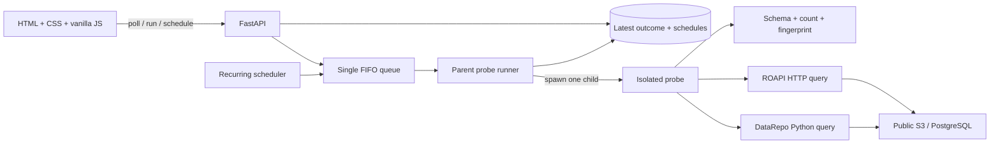

# DataRepo Doctor

DataRepo Doctor runs small, real, bounded queries through supported DataRepo retrieval paths and answers:

> Can the representative `doctor_reader` profile retrieve the entire expected result right now, and how long does the successful query take?

The application is intentionally lean: one FastAPI process, one FIFO probe queue, one SQLite database, and one dependency-free HTML/CSS/JavaScript dashboard. There is no React or Node build.

## What this proves—and what it does not

A check is **healthy** only when its real query completes and the complete materialized result passes:

1. exact ordered schema and type validation;
2. exact row-count validation; and
3. deterministic SHA-256 fingerprint validation.

Successful latency measures the supported user access path through complete materialization or HTTP decoding. Validation and persistence are measured separately. Latency never changes health. Failed and timed-out checks have no query-latency value.

This proves one bounded query works from this local environment with the `doctor_reader` profile. It does not prove every query works, every user has access, the data is fresh, or the data is scientifically valid.

## Real sources and access paths

| Check | Literal source | Retrieval path |
|---|---|---|
| AWS Products / Delta | AWS public S3 Delta tutorial table | DataRepo Python SDK → native Delta table |
| PUDL Energy Sources / Parquet | Catalyst Cooperative public S3 Parquet file | DataRepo Python SDK → native Parquet table |
| RNAcentral Cross-references | EMBL-EBI public PostgreSQL | DataRepo Python SDK → `@table` Python function → PostgreSQL |
| PUDL Energy Sources / ROAPI | The same public PUDL Parquet file | HTTP → ROAPI generated from the DataRepo catalog |

The normal dashboard reads these real public services. MinIO and local PostgreSQL exist only in the Compose `test` profile for deterministic integration and fault testing.

The web catalog is a discovery surface. The Python SDK and ROAPI are retrieval surfaces; loading a static catalog page is not a health check.

## Architecture



The subprocess boundary is deliberate. If a third-party query hangs, the parent kills and reaps that child, records `timeout`, and continues with the next FIFO job. The four public demo probes explicitly opt in to returning their small validated rows for display. Future probes default to metadata-only outcomes.

## Start from a clean checkout

Requirements: Docker with Compose and the current checkout.

```bash
cp .env.example .env
```

Set `DOCTOR_RNACENTRAL_PASSWORD` to the public reader password documented by RNAcentral, then run:

```bash
docker compose up --build
```

Compose validates/generates the ROAPI configuration, starts ROAPI, and starts the application. Open <http://localhost:8000>.

Stop while retaining SQLite state:

```bash
docker compose down
```

The app intentionally runs one Uvicorn worker. Multiple app processes would each create a queue and scheduler and are unsupported.

## Development and tests

Python 3.12 or 3.13 is supported.

```bash
python -m venv .venv
source .venv/bin/activate       # Windows: .venv\Scripts\activate
pip install -e ".[dev]"
pytest tests/unit
ruff check .
mypy src
```

Run the real local-service integration suite:

```bash
docker compose --profile test run --rm --build test
```

Build the production image without Node:

```bash
docker compose build app
```

## API

| Endpoint | Purpose |
|---|---|
| `GET /api/checks` | Complete safe dashboard state for every configured check |
| `POST /api/checks/{check_id}/run` | Enqueue Check Now or return the existing queued/running state |
| `PATCH /api/checks/{check_id}/schedule` | Persist `enabled` and/or an interval from 5 to 10,080 minutes |
| `GET /api/healthz` | FastAPI process liveness only |

The browser polls `/api/checks` every two seconds. There are no WebSockets and no result-history endpoints.

## Scheduling and persistence

- Every check defaults to 60 minutes.
- Stable initial offsets are 0, 5, 10, and 15 minutes.
- Manual runs do not change scheduled cadence.
- Scheduled and manual jobs share one deduplicating FIFO queue.
- SQLite stores two tables: `check_schedule` and one `latest_probe_run` row per check.
- For an explicitly displayable public probe, that latest outcome also contains its latest bounded result rows.
- Interval and enabled overrides survive restarts.
- Overdue checks are restored one per scheduler tick to avoid a restart herd.

## Failures and safe diagnostics

The dashboard shows one of five stable failure modes, a safe summary, and an optional scrubbed exception detail. URLs, DSNs, credentials, secret assignments, returned values inside errors, and full tracebacks are not exposed. When an unstructured third-party message cannot be retained safely, only its exception class is shown. Successful public demo checks separately show their explicitly opted-in bounded result rows.

| Mode | Meaning |
|---|---|
| `connection_error` | A dependency could not be reached or timed out before returning a response |
| `query_error` | Catalog resolution, authentication, query execution, or response decoding failed |
| `validation_error` | Schema, exact row count, or result fingerprint did not match; the summary identifies which validation failed |
| `timeout` | The parent killed a probe at its hard safety boundary |
| `worker_crash` | The child exited without returning an outcome |

Faults are injected only in tests. See [GUIDE.md](GUIDE.md) for commands and detailed walkthroughs.

## Adding a check

1. Add or expose the DataRepo table in `demo_catalog/`.
2. Add a typed `ProbeSpec` in `src/datarepo_doctor/checks.py`.
3. Bound it with explicit filters or function arguments and selected columns.
4. Declare deterministic sort columns, schema, exact count, timeout, phase offset, and safe query description.
5. Materialize the bounded result in the seeding/diagnostic context and calculate its canonical SHA-256 with `result_sha256`.
6. Set `display_result_rows=True` only when every returned value is approved for dashboard display and latest-outcome persistence.
7. Add unit and real integration coverage.

Never compute the expected fingerprint during a normal health run; that would make the expected result equal the observed result and eliminate the correctness check.

## Public-package deviation

The project depends on the public `data-repository==0.0.2` package and does not fork or modify DataRepo. DataRepo 0.0.2 pins Polars 1.12; the Docker image replaces that wheel with API-compatible `polars-lts-cpu==1.12.0` for CPU portability. Application behavior and DataRepo interfaces are unchanged.

For a ground-up explanation of every component and the exact code path, read [GUIDE.md](GUIDE.md).
