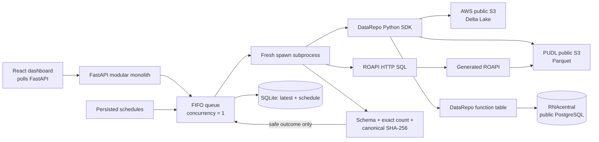

# DataRepo Doctor

DataRepo Doctor answers one narrow operational question for every configured check:

> If a scientist uses this supported DataRepo access path right now, can `doctor_reader` retrieve the
> entire bounded expected result, and how long does that successful query take?

The normal dashboard uses genuinely public, remotely hosted data. It executes read-only queries
through DataRepo's Python SDK or a DataRepo-generated ROAPI HTTP service, materializes each complete
bounded result in an isolated child process, validates its schema, exact row count, and deterministic
SHA-256 fingerprint, then discards the rows. Only the latest safe outcome is stored.

## What this proves—and what it does not

A healthy check proves that one bounded query, from this local deployment, through the named access
method, using the representative `doctor_reader` profile, returned the complete expected result at
that moment. It does not prove that every query works, every user has permission, the upstream data
is fresh, or the data is scientifically valid. This is retrieval monitoring, not data-quality
monitoring.

Latency is measured with `time.perf_counter_ns()` from the start of the supported user access path
(catalog import or HTTP request setup) until the complete result is materialized or decoded.
Validation and persistence are excluded. Latency never affects health. A failed or timed-out run has
no query latency; timeout is only a safety boundary.

## Live sources and access paths

The default registry deliberately crosses the same abstraction DataRepo was built to provide: a
scientist asks the catalog for a table, while DataRepo resolves and reads the underlying service.
The app does not download these datasets into its image or silently fall back to local files.

| Check | Supported retrieval surface | Literal upstream source |
|---|---|---|
| AWS Products / Delta | DataRepo Python SDK and native `DeltalakeTable` | AWS public S3 tutorial Delta table, Delta version 6 |
| PUDL Energy Sources / Parquet | DataRepo Python SDK and native `ParquetTable` | Catalyst Cooperative's versioned PUDL Parquet file in public S3 |
| RNAcentral Cross-references / Function | DataRepo `@table` function via Python SDK | EMBL-EBI's public RNAcentral PostgreSQL service |
| PUDL Energy Sources / ROAPI | SQL over the generated read-only HTTP API | ROAPI reads the same public PUDL object directly from S3 |

The exact URIs, owner, version, license label, and source documentation are visible in each dashboard
detail view. See the [AWS Delta tutorial](https://aws.amazon.com/blogs/big-data/introducing-native-delta-lake-table-support-with-aws-glue-crawlers/),
[PUDL data-access documentation](https://docs.catalyst.coop/pudl/en/v2026.4.0/data_access.html),
and [RNAcentral public database documentation](https://rnacentral.org/help/public-database).
RNAcentral publishes releases from version 20 onward under
[CC0](https://rnacentral.org/license); PUDL publishes its processed data under CC-BY-4.0.

The checked PUDL URI is pinned to `v2024.11.0` so the contract is reproducible. The public AWS and
RNAcentral services are externally maintained; an upstream outage or a changed bounded result is a
real unhealthy outcome, not test noise. Controlled local MinIO and PostgreSQL sources remain
available only under the Compose `test` profile for fault injection and repeatable integration tests.

The DataRepo static web catalog is a discovery and documentation surface. It is not counted as a
retrieval surface; Python and ROAPI are the user data-query paths monitored here.

## Architecture



Pings and metadata lookups are insufficient because they can succeed while a user-visible query,
credential path, object URI, decoding step, or complete result is broken. These slices are small and
deterministically bounded, so schema + exact count + fingerprint detects missing, extra, or changed
rows without retaining their values.

## Start from a clean checkout

Requirements: Docker Desktop with Compose, at least 4 GB available memory, and outbound internet
access to public HTTPS/S3 and PostgreSQL port 5432.

1. Copy `.env.example` to `.env`.
2. Put RNAcentral's published public-reader password in `DOCTOR_RNACENTRAL_PASSWORD`. Obtain it from
   the official [public database page](https://rnacentral.org/help/public-database); it is still kept
   out of Git, SQLite, logs, API responses, and browser output.
3. Start the app:

```bash
docker compose up --build -d
```

On Windows PowerShell, use `Copy-Item .env.example .env`. Open <http://localhost:8000>; ROAPI is at
<http://localhost:8080>. The configure container generates and validates ROAPI configuration from
the DataRepo catalog. No local data seeding occurs in the normal stack.

The initial recurring schedule is hourly with stable offsets of 0, 5, 10, and 15 minutes. Use
**Check now** on each row to run all four immediately; scheduled and manual jobs share one FIFO
worker. Manual runs do not move `next_run_at`. Interval overrides (minimum five minutes), enabled
state, next-run metadata, and one latest outcome per check survive app restarts in the `app-data`
volume. There is no result history, trend aggregation, or returned-row storage.

Useful operations:

```bash
docker compose ps
docker compose logs -f app configure roapi
docker compose run --rm configure
docker compose down
```

## Development and tests

Python 3.12 or 3.13 is required locally because `data-repository==0.0.2` constrains Polars to a
release without Python 3.14 wheels. The container installs the matching `polars-lts-cpu` wheel for
hosts without AVX2. ROAPI is built from the pinned public `roapi==0.12.7` wheel.

```bash
python -m venv .venv
python -m pip install -e ".[dev]"
cd web && npm ci && cd ..
pytest tests/unit
ruff check .
mypy src
cd web && npm test -- --run && npm run lint && npm run typecheck && npm run build
```

The integration profile adds controlled MinIO/PostgreSQL fixtures, seeds them idempotently, and also
executes the four external checks:

```bash
docker compose --profile test run --rm --build test
```

The suite proves native Delta and Parquet reads through DataRepo, function-table access to
PostgreSQL, and real ROAPI HTTP retrieval. It covers spec safety, canonical values, mismatch
taxonomy, redaction, schedule restoration, queue deduplication, timeout, worker crash, and successful
continuation after both isolation failures.

## Demonstrating failures safely

Faults are never in the normal registry. Prefer the automated integration tests; they use the
controlled test-profile services and do not modify public data.

| Failure | Demonstration | Expected mode |
|---|---|---|
| Missing object | Run `test_invalid_object_path_is_unhealthy` | `source_not_found`, or truthful `query_execution_error` if delta-rs exposes an opaque cause |
| Invalid object credentials | Run `test_invalid_object_credentials_are_unhealthy` | `authentication_error` / `authorization_error`, or documented opaque fallback |
| PostgreSQL stopped | Stop the test-profile PostgreSQL service for its fault test | `connection_error` |
| ROAPI stopped | `docker compose stop roapi`, run its check, then start ROAPI | `connection_error` and no latency |
| Wrong schema/count/value | Run the contract fault integration tests | `schema_mismatch`, `row_count_mismatch`, `result_fingerprint_mismatch` |
| Hanging function | Run the isolated queue fault unit test | `timeout`; next job succeeds |
| Child exit | Run the isolated queue fault unit test | `worker_crash`; next job succeeds |

API-visible failures use stable codes and sanitized summaries. Raw exception messages, tracebacks,
URLs, credentials, filter literal values, response bodies, and result rows never cross the worker
boundary or enter SQLite or structured logs.

## Adding a check

1. Add a native table or `@table` function beside `demo_catalog/tables.py`.
2. Add one immutable `ProbeSpec` in `registry/probes.py`: explicit filters or arguments, selected
   columns, canonical sort, exact schema/count/hash, timeout, source provenance, and phase offset are
   mandatory.
3. Compute the bounded contract using the same canonical pipeline and review it before checking in
   the hash. Never include returned values or credentials in application output.
4. Add a real integration assertion. Do not query the source directly from a probe or substitute an
   unbounded query, metadata lookup, storage ping, or `limit(1)`.

Canonical format `drd-canonical-v1` is implemented in `domain/canonical.py`: UTF-8 JSON Lines with an
ordered schema header and tagged values. Nulls are explicit; decimals are normalized strings; finite
floats use exact hexadecimal notation; dates use ISO 8601; timestamps normalize to UTC; column order
and deterministic row sorting are part of the digest.

## Failure taxonomy

| Stage | Representative modes |
|---|---|
| Configuration/catalog | `invalid_probe_config`, `catalog_import_error`, `table_not_found` |
| Identity/network/source | `authentication_error`, `authorization_error`, `dns_error`, `connection_error`, `source_not_found` |
| Query/HTTP/decode | `query_execution_error`, `http_error`, `response_decode_error` |
| Complete-result validation | `schema_mismatch`, `row_count_mismatch`, `result_fingerprint_mismatch` |
| Isolation safety | `timeout`, `worker_crash`, `unknown` |

Classification uses typed HTTP, socket, PostgreSQL, validation, and structured botocore errors. When
delta-rs/object-store collapses a cause into an opaque exception, the monitor reports the truthful
`query_execution_error` fallback rather than inferring from brittle message text.

## Public-package deviation

DataRepo itself is not forked or modified. This project pins the current published
`data-repository==0.0.2` package. Its README shows `datarepo.export.roapi.generate_config(...)`, but
that function is absent from the wheel. The wheel does expose `export_to_roapi_tables(catalog)`, so
the configure command uses that public function and serializes its returned table dictionaries to
ROAPI YAML. ROAPI's JSON encoding omits null-valued object properties, so the adapter restores an
omitted property only when the checked contract declares that column nullable; an omitted required
property remains a decode failure. Public unsigned S3 reads set the object-store option documented
by delta-rs.
