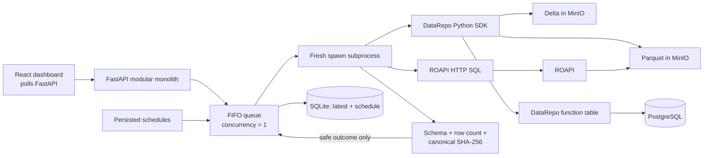

# DataRepo Doctor

DataRepo Doctor answers one deliberately narrow operational question for every configured check:

> If a scientist uses this supported DataRepo access path right now, can `doctor_reader` retrieve the
> entire bounded expected result, and how long does that successful query take?

It runs real read-only queries through DataRepo's Python SDK or a generated ROAPI HTTP API, fully
materializes the bounded result in an isolated child process, validates its schema, exact row count,
and deterministic SHA-256 fingerprint, then discards the rows. The dashboard stores and shows only
the latest safe outcome.

## What this proves—and what it does not

A healthy check proves that **one bounded query**, from the local environment, through the named
access method, using the representative `doctor_reader` identity, returned the complete expected
fixture result at that moment. It does not prove that every query works, every user has permission,
the data is fresh, or the data is scientifically valid. It is retrieval monitoring, not data-quality
monitoring.

Latency is measured with `time.perf_counter_ns()` from the start of the supported user access path
(catalog import or HTTP request setup) until the complete result is materialized/decoded. Validation
and persistence are excluded. Latency never affects health. A failed or timed-out run has no query
latency; timeout is only a safety boundary.

## Architecture



Pings and metadata lookups are insufficient because they can succeed while a user-visible query,
credential path, object prefix, decoding step, or complete result is broken. Complete bounded results
are small enough to materialize, and schema + exact count + fingerprint detects missing, extra, or
changed rows without persisting values.

The demo catalog contains:

| Check | Retrieval surface | Real source |
|---|---|---|
| Part / Delta | DataRepo Python SDK, native `DeltalakeTable` | Delta Lake in MinIO |
| Orders / Parquet | DataRepo Python SDK, native `ParquetTable` | Hive Parquet in MinIO |
| Supplier / Function | DataRepo `@table` function via Python SDK | PostgreSQL |
| Orders / ROAPI | ROAPI HTTP SQL generated from the DataRepo catalog | Parquet in MinIO |

The DataRepo static web catalog is a discovery/documentation surface. It is not counted as a retrieval
surface; the Python SDK and ROAPI are the supported data-query paths tested here.

## Start from a clean checkout

Requirements: Docker Desktop with Compose and at least 4 GB available memory.

```bash
cp .env.example .env
docker compose up --build -d
```

On Windows PowerShell, use `Copy-Item .env.example .env` for the first command. The Compose command
creates the bucket, read-only MinIO policy/user, genuine Delta and Parquet objects, PostgreSQL table
and read-only role, generated ROAPI config, SQLite schema, and application. Seeding is idempotent.

Open <http://localhost:8000>. MinIO's local console is at <http://localhost:9001> and ROAPI at
<http://localhost:8080>. The initial recurring schedule is hourly with stable offsets of 0, 5, 10,
and 15 minutes. Use **Check now** on each row to run all four immediately; they share one FIFO worker.

Useful operations:

```bash
docker compose ps
docker compose logs -f app seed roapi
docker compose run --rm seed
docker compose down
```

Manual runs do not move `next_run_at`. Interval overrides (minimum five minutes), enabled state,
next-run metadata, and one latest outcome per check survive app restarts in the `app-data` volume.
There is no result history, trend aggregation, or returned-row storage.

## Development and tests

Python 3.12/3.13 is required locally because the public `data-repository==0.0.2` dependency constrains
Polars to a release without Python 3.14 wheels.
The container installs Polars' matching `polars-lts-cpu` wheel so the same DataRepo version also runs
on VM/container hosts that do not expose AVX2; no DataRepo interface is changed.
ROAPI is installed from its public `roapi==0.12.7` manylinux wheel in a minimal local image rather than
using an unversioned container tag; this pins the real ROAPI binary and retains conservative CPU support.

```bash
python -m venv .venv
python -m pip install -e ".[dev]"
cd web && npm ci && cd ..
pytest tests/unit
ruff check src demo_catalog tests
mypy src/datarepo_doctor
cd web && npm test -- --run && npm run lint && npm run build
```

With the Compose dependencies healthy, run real integrations in the app image:

```bash
docker compose --profile test run --rm test
```

The integration suite proves that Delta and Parquet are read from MinIO through DataRepo, PostgreSQL
is read through the function table, and ROAPI is queried over HTTP. Unit/fault tests cover spec safety,
canonical values, mismatch taxonomy, redaction, schedule restoration, queue deduplication, timeout,
worker crash, and continuation to the next job.

## Demonstrating failures safely

Faults are never present in the normal registry. Run their automated tests, or use these local demo
steps and restore the service immediately afterward:

| Failure | Demonstration | Expected mode |
|---|---|---|
| Missing object prefix | Run the fault spec in `tests/integration/test_real_paths.py` | `source_not_found`, or documented `query_execution_error` when delta-rs exposes only an opaque error |
| Invalid object credential | Run `test_invalid_object_credentials_are_unhealthy` | `authentication_error` / `authorization_error`; truthful opaque fallback is asserted |
| PostgreSQL stopped | `docker compose stop postgres`, run Supplier, then `docker compose start postgres` | `connection_error` |
| ROAPI stopped | `docker compose stop roapi`, run Orders / ROAPI, then `docker compose start roapi` | `connection_error` |
| Wrong schema/count/value | Run the contract fault integration tests | `schema_mismatch`, `row_count_mismatch`, `result_fingerprint_mismatch` |
| Hanging function | Run the isolated queue fault test | `timeout`; next job succeeds |
| Child exit | Run the isolated queue fault test | `worker_crash`; next job succeeds |

API-visible failures use stable codes and constant sanitized summaries. Raw exception messages,
tracebacks, URLs, credentials, filter literal values, response bodies, and result rows never cross the
worker boundary or enter SQLite/log output.

## Adding a check

1. Add a native table or `@table` function beside `demo_catalog/tables.py`.
2. Add one immutable `ProbeSpec` in `registry/probes.py`: explicit filters/function arguments,
   selected columns, canonical sort, exact schema/count/hash, timeout, and phase offset are mandatory.
3. Extend deterministic seeding and run `python -m datarepo_doctor.seed` to verify the checked-in hash.
4. Add a real integration assertion. Do not query a source directly from a probe or use an unbounded
   query, metadata lookup, storage ping, or `limit(1)` substitute.

Canonical format `drd-canonical-v1` is documented in `domain/canonical.py`: UTF-8 JSON Lines with an
ordered schema header and tagged values. Nulls are explicit; decimals are normalized strings; finite
floats use exact hexadecimal notation; dates use ISO 8601; timestamps normalize to UTC; column order
and deterministic row sorting are part of the digest.

## Failure taxonomy

| Stage | Representative modes |
|---|---|
| Configuration/catalog | `invalid_probe_config`, `catalog_import_error`, `table_not_found` |
| Identity/network/source | `authentication_error`, `authorization_error`, `dns_error`, `connection_error`, `source_not_found` |
| Query/HTTP/decode | `query_execution_error`, `http_error`, `response_decode_error` |
| Complete-result validation | `schema_mismatch`, `row_count_mismatch`, `result_fingerprint_mismatch` |
| Isolation safety | `timeout`, `worker_crash`, `unknown` |

Classification uses typed HTTP, socket, PostgreSQL, validation, and structured botocore errors. Where
delta-rs/object-store collapses a cause into an opaque exception, the monitor reports the truthful
`query_execution_error` fallback instead of inferring from brittle message text.

## Public API deviation

The current public package is pinned to `data-repository==0.0.2`. Its published README shows
`datarepo.export.roapi.generate_config(...)`, but that function is absent from the wheel. The package
does expose `export_to_roapi_tables(catalog)`, so the seed command uses that public function and safely
serializes the returned table dictionaries to ROAPI YAML. DataRepo itself is neither forked nor
modified.
